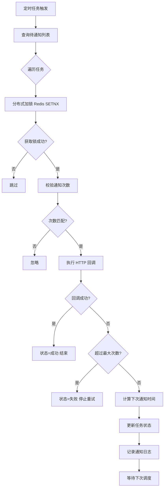

# 定时任务 - 日志记录与重试机制

> 学习日期：2026-04-17
> 任务编号：03
> 状态：✅ 已完成

---

## ① Why - 价值 (为什么)

### 背景与痛点

- **痛点1**：任务执行失败后没有记录，无法排查问题
- **痛点2**：网络抖动导致通知失败，业务方收不到回调
- **痛点3**：失败后需要手动重试，运维成本高

### 收益

- 每次执行都有日志记录，可追溯
- 自动重试机制，提高成功率
- 失败告警，及时发现问题

### 用户

- 后端开发者、运维工程师

---

## ② What - 定义 (是什么)

### 一句话定义

XXL-Job 执行器内置日志记录和重试机制，确保任务可追溯、失败可恢复。

### 核心组成

| 组成 | 说明 |
|------|------|
| 执行日志 | 记录任务执行过程和结果 |
| 重试机制 | 失败后按策略自动重试 |
| 回调通知 | 异步回调业务系统 |

### 关键术语

- `logPath` - 执行日志存储路径
- `logRetentionDays` - 日志保留天数
- `notifyTimes` - 已通知次数
- `maxNotifyTimes` - 最大通知次数

---

## ③ How - 思维 (怎么做)

### 目标

实现任务执行日志记录和自动重试

### 范围

- **允许**：`yudao-module-pay/notify/`
- **禁止**：修改调度中心表结构

### 禁止事项

- 禁止修改 XXL-Job 内置日志表
- 禁止改动重试策略配置

### 数据模型

#### PayNotifyTaskDO - 支付通知任务表

```java
// 文件位置：yudao-module-pay/yudao-module-pay-server/src/main/java/cn/iocoder/yudao/module/pay/dal/dataobject/notify/PayNotifyTaskDO.java

@TableName("pay_notify_task")
public class PayNotifyTaskDO extends TenantBaseDO {

    // 通知频率：15s, 15s, 30s, 3m, 30m, 30m, 30m, 1h (共9次)
    public static final Integer[] NOTIFY_FREQUENCY = new Integer[]{
            15, 15, 30, 180, 1800, 1800, 1800, 3600
    };

    private Long id;              // 任务ID
    private Long appId;           // 应用编号
    private Integer type;         // 通知类型(1订单2退款3转账)
    private Long dataId;          // 业务数据ID
    private String merchantOrderId;  // 商户订单编号
    private Integer status;       // 状态(0待通知1成功2失败)
    private LocalDateTime nextNotifyTime; // 下次通知时间
    private LocalDateTime lastExecuteTime; // 最后一次执行时间
    private Integer notifyTimes;  // 当前通知次数
    private Integer maxNotifyTimes; // 最大可通知次数
    private String notifyUrl;     // 通知地址
}
```

#### PayNotifyLogDO - 通知日志表

```java
// 文件位置：yudao-module-pay/yudao-module-pay-server/src/main/java/cn/iocoder/yudao/module/pay/dal/dataobject/notify/PayNotifyLogDO.java

@TableName("pay_notify_log")
public class PayNotifyLogDO extends BaseDO {

    private Long id;              // 日志ID
    private Long taskId;          // 任务ID
    private Integer notifyTimes;  // 通知次数
    private Integer status;       // 状态
    private String response;      // HTTP响应内容
}
```

### 关键流程图



### 关键类

| 类 | 职责 |
|------|------|
| `PayNotifyJob` | 定时扫描任务，每分钟执行 |
| `PayNotifyServiceImpl` | 通知执行服务，核心逻辑 |
| `PayNotifyTaskMapper` | 待通知任务查询 |
| `PayNotifyLogMapper` | 日志记录 |
| `PayNotifyLockRedisDAO` | 分布式锁 |

---

## ④ Hard - 难点 (挑战)

### 难点1：任务重复执行

**场景**：多节点部署，同时触发通知同一笔订单

**问题**：3台机器同时抢锁，可能导致重复通知

**解决方案**：

```java
// 1. 分布式锁
notifyLockCoreRedisDAO.lock(task.getId(), NOTIFY_TIMEOUT_MILLIS, () -> {
    // 2. 校验通知次数，防止并发
    PayNotifyTaskDO dbTask = notifyTaskMapper.selectById(task.getId());
    if (ObjectUtil.notEqual(task.getNotifyTimes(), dbTask.getNotifyTimes())) {
        log.warn("任务被忽略，通知次数不匹配");
        return;
    }
    // 3. 执行通知
    executeNotify0(dbTask);
});
```

### 难点2：通知超时

**场景**：业务接口响应慢，导致任务堆积

**解决方案**：

```java
// 超时时间 120 秒
public static final int NOTIFY_TIMEOUT = 120;

// 超时强制结束
try (HttpResponse response = HttpUtil.createPost(task.getNotifyUrl())
        .timeout((int) NOTIFY_TIMEOUT_MILLIS).execute()) {
    // ...
}
```

### 难点3：重试次数用尽

**场景**：通知9次仍失败

**解决方案**：

```java
// 超过最大回调次数，更新状态为失败，不再重试
if (updateTask.getNotifyTimes() >= PayNotifyTaskDO.NOTIFY_FREQUENCY.length) {
    updateTask.setStatus(PayNotifyStatusEnum.FAILURE.getStatus());
    notifyTaskMapper.updateById(updateTask);
}
```

### 难点4：分布式环境下日志丢失

**场景**：服务重启，日志未持久化

**解决方案**：

- 每次执行都记录到数据库
- 不依赖内存，事务提交后异步执行

---

## ⑤ Metric - 衡量 (指标)

| 指标 | 权重 | 说明 | 验证方法 |
|------|------|------|----------|
| 通知成功率 ≥95% | 30% | 成功次数/总次数 | 数据库统计 |
| 日志记录完整率 =100% | 25% | 每条都有日志 | 日志表查询 |
| 重试机制生效 | 20% | 失败后自动重试 | 测试验证 |
| 日志可查30天 | 15% | 历史日志可查 | 日志表查询 |
| 重复执行次数 =0 | 10% | 分布式锁生效 | 测试验证 |

### 验证脚本

```sql
-- 查看通知日志
SELECT * FROM pay_notify_log WHERE task_id = 1 ORDER BY notify_times DESC;

-- 查看待通知任务
SELECT * FROM pay_notify_task WHERE status = 0;

-- 统计通知成功率
SELECT 
    (SELECT COUNT(*) FROM pay_notify_task WHERE status = 1) * 1.0 / 
    (SELECT COUNT(*) FROM pay_notify_task) as success_rate;
```

---

## ⑥ Select - 选型 (选哪个)

### 候选方案对比

| 方案 | 优点 | 缺点 | 适用场景 |
|------|------|------|----------|
| XXL-Job 内置 | 无需额外配置 | 功能有限 | 简单任务 |
| 自定义重试 | 可控性强 | 需要开发 | 支付回调 |
| 消息队列重试 | 解耦、可靠 | 需要MQ | 复杂场景 |

### 选型理由

1. **yudao-module-pay 已实现完整重试机制** - 开箱即用
2. **分布式锁+数据库日志** - 安全可靠，支持多节点
3. **指数退避策略** - 合理利用资源，15s→15s→30s→3m→30m→30m→30m→1h

### 通知次数配置

```java
// PayNotifyTaskDO.java
public static final Integer[] NOTIFY_FREQUENCY = new Integer[]{
    15,    // 15秒后
    15,    // 15秒后
    30,    // 30秒后
    180,   // 3分钟后
    1800,  // 30分钟后
    1800,  // 30分钟后
    1800,  // 30分钟后
    3600   // 1小时后
};
// 最大通知次数 = 数组长度 + 1 = 9次
```

---

## ⑦ Impl - 实现 (细节)

### 配置文件

```yaml
# application.yml
xxl:
  job:
    executor:
      logPath: /tmp/xxl-job
      logRetentionDays: 30
```

### 核心代码 - PayNotifyJob

```java
// 文件位置：yudao-module-pay/yudao-module-pay-server/src/main/java/cn/iocoder/yudao/module/pay/job/notify/PayNotifyJob.java

@Component
public class PayNotifyJob {

    @Resource
    private PayNotifyService payNotifyService;

    @XxlJob("payNotifyJob")
    @TenantJob // 多租户
    public String execute() throws Exception {
        int notifyCount = payNotifyService.executeNotify();
        log.info("[execute][执行支付通知 ({}) 个]", notifyCount);
        return "执行支付通知 (" + notifyCount + ") 个";
    }
}
```

### 核心代码 - PayNotifyServiceImpl.executeNotify

```java
// 文件位置：yudao-module-pay/yudao-module-pay-server/src/main/java/cn/iocoder/yudao/module/pay/service/notify/PayNotifyServiceImpl.java

@Override
public int executeNotify() throws InterruptedException {
    // 获得需要通知的任务
    List<PayNotifyTaskDO> tasks = notifyTaskMapper.selectListByNotify();
    if (CollUtil.isEmpty(tasks)) {
        return 0;
    }

    // 遍历，逐个通知（并行）
    CountDownLatch latch = new CountDownLatch(tasks.size());
    tasks.forEach(task -> threadPoolTaskExecutor.execute(() -> {
        try {
            executeNotify(task);
        } finally {
            latch.countDown();
        }
    }));
    awaitExecuteNotify(latch);
    return tasks.size();
}
```

### 执行流程

```
Step 1: 定时任务扫描
  → PayNotifyJob 每分钟执行
  → 查询待通知任务列表

Step 2: 分布式加锁
  → Redis SETNX 加锁
  → 校验 notifyTimes

Step 3: 执行通知
  → HTTP 调用业务接口
  → 记录响应日志

Step 4: 更新状态
  → 成功 → 状态=成功
  → 失败 → 更新下次通知时间
```

---

## ⑧ SKILL - 提炼 (复用)

### 触发条件

- 场景1：支付回调需要重试机制
- 场景2：需要查看任务执行日志
- 场景3：任务失败需要告警

### 执行流程

```
Step 1: 引入依赖
  - 已集成在 yudao-module-pay 中

Step 2: 创建通知任务
  - PayNotifyService.createPayNotifyTask(type, dataId)

Step 3: 配置定时任务
  - PayNotifyJob 已注册到 XXL-Job

Step 4: 查看日志
  - pay_notify_task 表 + pay_notify_log 表
```

### 配方

- **最大重试次数**：9次
- **超时时间**：120秒
- **重试间隔**：15s→15s→30s→3m→30m→30m→30m→1h

### 验收标准

- [x] 通知成功率高（≥95%）
- [x] 日志完整可查
- [x] 失败自动重试
- [x] 分布式环境无重复

---

## 参考资料

- [芋道源码 - 支付通知](https://doc.iocoder.cn/pay/notify/)
- [XXL-Job 官方文档](https://www.xuxueli.com/xxl-job/)