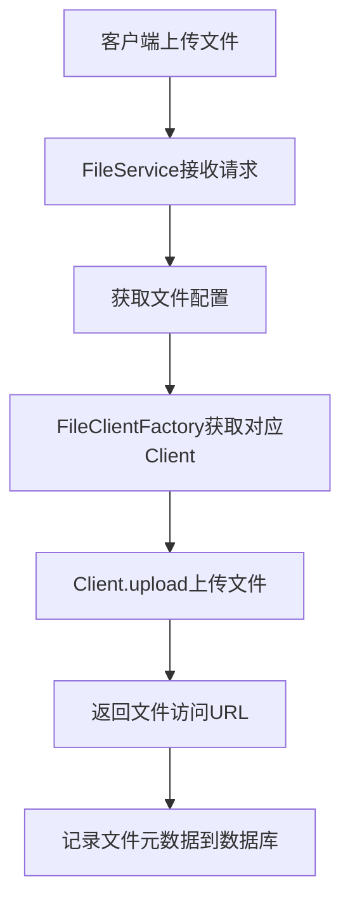
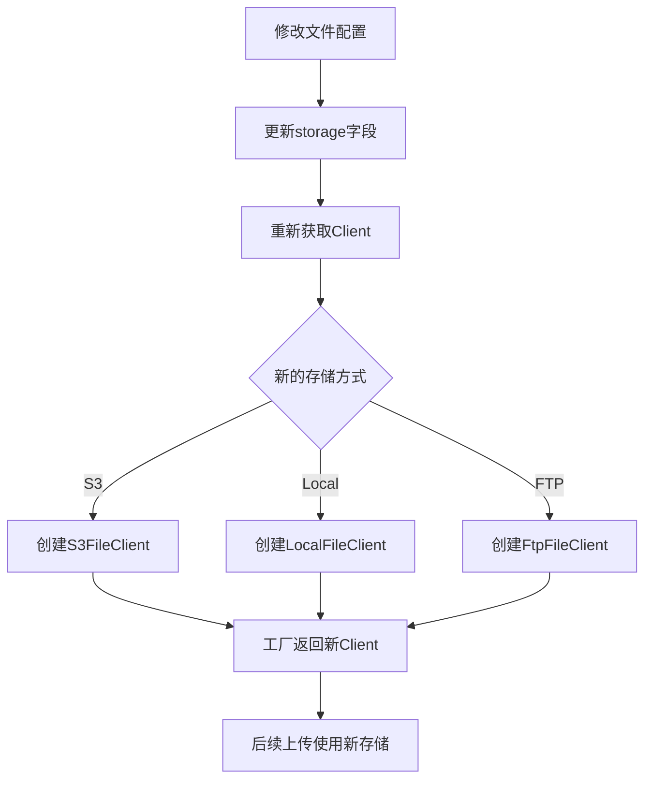

# 07-文件服务抽象

> 文件存储 - 服务抽象与策略模式

---

## ① Why - 价值 (为什么)

### 背景与痛点

在企业级应用开发中，文件存储是常见需求。不同业务场景可能需要不同的存储方式：
- 开发测试环境：本地文件存储
- 生产环境：对象存储服务（阿里云OSS、华为云OBS、MinIO等）
- 某些场景：FTP/SFTP服务器存储

**痛点**：
1. 如果存储方式写死在代码中，切换存储介质需要修改大量代码
2. 新增一种存储方式需要修改现有代码，违反开闭原则
3. 业务代码需要关心底层存储实现，耦合度高

### 业务场景

```
举例：用户头像上传
- 开发环境：存在本地磁盘 /data/uploads/
- 测试环境：存到MinIO对象存储
- 生产环境：切换到阿里云OSS

如果代码中硬编码了存储逻辑，每次切换都要改代码，风险很高。
```

---

## ② What - 定义 (是什么)

### 核心概念

| 概念 | 定义 |
|------|------|
| **文件服务抽象** | 将文件存储操作抽象为统一接口，屏蔽底层实现细节 |
| **策略模式** | 定义一系列存储算法，将它们一一封装，使它们可以互相替换 |
| **FileClient** | 文件客户端接口，定义上传、删除、读取等基本操作 |
| **FileClientFactory** | 客户端工厂，根据配置创建对应的存储客户端 |

### yudao-cloud中的文件存储架构

```
┌─────────────────────────────────────────────────────────┐
│                    FileService                          │
│                   (文件服务接口)                         │
└─────────────────────┬───────────────────────────────────┘
                      │
                      ▼
┌─────────────────────────────────────────────────────────┐
│                 FileClientFactory                       │
│                 (客户端工厂)                             │
└─────────────────────┬───────────────────────────────────┘
                      │
        ┌─────────────┼─────────────┬─────────────┐
        │             │             │             │
        ▼             ▼             ▼             ▼
   ┌─────────┐   ┌─────────┐  ┌─────────┐   ┌─────────┐
   │  Local  │   │   S3    │  │   FTP   │   │   SFTP  │
   │ FileClient    │FileClient   │FileClient  │FileClient
   └─────────┘   └─────────┘  └─────────┘   └─────────┘
   (本地存储)   (对象存储)   (FTP存储)    (SFTP存储)
```

---

## ③ How - 思维 (怎么做)

### 数据模型设计

#### 文件配置表

```sql
-- 文件配置表
CREATE TABLE infra_file_config (
    id BIGINT PRIMARY KEY AUTO_INCREMENT COMMENT '配置编号',
    name VARCHAR(50) NOT NULL COMMENT '配置名称',
    storage INTEGER NOT NULL DEFAULT 10 COMMENT '存储方式: 1-数据库 10-本地 11-FTP 12-SFTP 20-S3',
    config VARCHAR(500) COMMENT '存储配置(JSON)',
    enabled BOOLEAN DEFAULT TRUE COMMENT '是否启用',
    creator VARCHAR(64) DEFAULT '' COMMENT '创建者',
    create_time DATETIME DEFAULT CURRENT_TIMESTAMP COMMENT '创建时间',
    updater VARCHAR(64) DEFAULT '' COMMENT '更新者',
    update_time DATETIME DEFAULT CURRENT_TIMESTAMP ON UPDATE CURRENT_TIMESTAMP COMMENT '更新时间',
    deleted BOOLEAN DEFAULT FALSE COMMENT '是否删除'
);
```

#### 文件表

```sql
-- 文件表
CREATE TABLE infra_file (
    id BIGINT PRIMARY KEY AUTO_INCREMENT COMMENT '文件编号',
    config_id BIGINT NOT NULL COMMENT '配置编号',
    name VARCHAR(255) NOT NULL COMMENT '文件名称',
    path VARCHAR(500) NOT NULL COMMENT '文件路径',
    url VARCHAR(500) COMMENT '文件URL',
    type VARCHAR(50) COMMENT '文件类型',
    size BIGINT COMMENT '文件大小',
    creator VARCHAR(64) DEFAULT '' COMMENT '创建者',
    create_time DATETIME DEFAULT CURRENT_TIMESTAMP COMMENT '创建时间',
    updater VARCHAR(64) DEFAULT '' COMMENT '更新者',
    update_time DATETIME DEFAULT CURRENT_TIMESTAMP ON UPDATE CURRENT_TIMESTAMP COMMENT '更新时间',
    deleted BOOLEAN DEFAULT FALSE COMMENT '是否删除'
);
```

### 关键流程设计

#### 文件上传流程



#### 存储策略切换流程



### 关键代码设计

#### FileClient接口定义

```java
/**
 * 文件客户端接口 - 策略模式的抽象
 */
public interface FileClient {
    
    /**
     * 获取客户端ID
     */
    Long getId();
    
    /**
     * 上传文件
     * @param content 文件内容
     * @param path 相对路径
     * @param type 文件类型
     * @return 文件访问URL
     */
    String upload(byte[] content, String path, String type) throws Exception;
    
    /**
     * 删除文件
     * @param path 相对路径
     */
    void delete(String path) throws Exception;
    
    /**
     * 获取文件内容
     * @param path 相对路径
     * @return 文件字节数组
     */
    byte[] getContent(String path) throws Exception;
    
    /**
     * 获取预签名上传URL（S3特性）
     */
    default String presignPutUrl(String path) {
        throw new UnsupportedOperationException("不支持");
    }
    
    /**
     * 获取预签名下载URL（S3特性）
     */
    default String presignGetUrl(String url, Integer expirationSeconds) {
        throw new UnsupportedOperationException("不支持");
    }
}
```

#### 本地存储策略实现

```java
/**
 * 本地文件存储策略
 */
@Component
public class LocalFileClient extends AbstractFileClient<LocalFileClientConfig> {
    
    @Override
    public String upload(byte[] content, String path, String type) throws Exception {
        // 1. 构建完整文件路径
        String filePath = buildFilePath(path);
        
        // 2. 确保目录存在
        File file = new File(filePath);
        file.getParentFile().mkdirs();
        
        // 3. 写入文件
        Files.write(file.toPath(), content);
        
        // 4. 返回访问URL
        return getFileUrl(path);
    }
    
    @Override
    public void delete(String path) throws Exception {
        String filePath = buildFilePath(path);
        Files.deleteIfExists(Paths.get(filePath));
    }
    
    @Override
    public byte[] getContent(String path) throws Exception {
        String filePath = buildFilePath(path);
        return Files.readAllBytes(Paths.get(filePath));
    }
    
    private String buildFilePath(String path) {
        // 拼接基础目录 + 相对路径
        return config.getBasePath() + "/" + path;
    }
}
```

#### S3对象存储策略实现

```java
/**
 * S3对象存储策略（支持阿里云OSS、MinIO等）
 */
@Component
public class S3FileClient extends AbstractFileClient<S3FileClientConfig> {
    
    private AmazonS3 amazonS3;
    
    @PostConstruct
    public void init() {
        // 初始化S3客户端
        this.amazonS3 = AmazonS3ClientBuilder.standard()
            .withEndpointConfiguration(
                new EndpointConfiguration(config.getEndpoint(), config.getRegion()))
            .withCredentials(
                new AWSStaticCredentialsProvider(
                    new BasicAWSCredentials(config.getAccessKey(), config.getSecretKey())))
            .withPathStyleAccessEnabled(true)
            .build();
    }
    
    @Override
    public String upload(byte[] content, String path, String type) throws Exception {
        // 1. 创建对象元数据
        ObjectMetadata metadata = new ObjectMetadata();
        metadata.setContentLength(content.length);
        metadata.setContentType(type);
        
        // 2. 上传到S3
        amazonS3.putObject(config.getBucket(), path, 
            new ByteArrayInputStream(content), metadata);
        
        // 3. 返回访问URL
        return String.format("https://%s.%s/%s", 
            config.getBucket(), config.getEndpoint(), path);
    }
    
    @Override
    public void delete(String path) throws Exception {
        amazonS3.deleteObject(config.getBucket(), path);
    }
    
    @Override
    public byte[] getContent(String path) throws Exception {
        S3Object object = amazonS3.getObject(config.getBucket(), path);
        return IOUtils.toByteArray(object.getObjectContent());
    }
    
    @Override
    public String presignPutUrl(String path) {
        // 生成预签名上传URL
        return amazonS3.generatePresignedUrl(
            config.getBucket(), path, 3600).toString();
    }
    
    @Override
    public String presignGetUrl(String url, Integer expirationSeconds) {
        // 解析path并生成预签名下载URL
        String path = extractPath(url);
        return amazonS3.generatePresignedUrl(
            config.getBucket(), path, expirationSeconds).toString();
    }
}
```

#### 客户端工厂（策略上下文）

```java
@Component
public class FileClientFactoryImpl implements FileClientFactory {
    
    @Autowired
    private Map<String, FileClient> fileClients;  // 自动注入所有FileClient实现
    
    @Override
    public FileClient getFileClient(Long configId) {
        // 1. 从数据库获取配置
        FileConfigDO config = fileConfigMapper.selectById(configId);
        if (config == null) {
            throw new BusinessException("文件配置不存在");
        }
        
        // 2. 根据storage类型获取对应Client
        FileStorageEnum storage = FileStorageEnum.getByStorage(config.getStorage());
        if (storage == null) {
            throw new BusinessException("不支持的存储类型");
        }
        
        // 3. 从Spring容器获取对应的Client Bean
        String beanName = storage.name() + "FileClient";  // 如: LOCAL, S3
        FileClient fileClient = fileClients.get(beanName.toLowerCase());
        if (fileClient == null) {
            throw new BusinessException("文件客户端未配置");
        }
        
        // 4. 设置配置并返回
        fileClient.initConfig(config.getConfig());
        return fileClient;
    }
}
```

---

## ④ Hard - 难点 (挑战)

### 问题1：存储策略的热切换

**场景**：修改文件配置后，希望立即生效，不需要重启服务

**解决方案**：
```java
@Component
public class FileClientFactoryImpl implements FileClientFactory {
    
    // 缓存客户端，避免频繁创建
    private final Map<Long, FileClient> clientCache = new ConcurrentHashMap<>();
    
    @Override
    public FileClient getFileClient(Long configId) {
        // 每次获取最新配置，确保热切换
        return getOrCreateClient(configId);
    }
    
    private FileClient getOrCreateClient(Long configId) {
        // 直接从数据库读取最新配置
        FileConfigDO config = fileConfigMapper.selectById(configId);
        
        // 每次创建新实例，确保配置更新立即生效
        FileStorageEnum storage = FileStorageEnum.getByStorage(config.getStorage());
        return createClient(storage, config.getConfig());
    }
}
```

### 问题2：不同存储的配置差异

**场景**：Local、FTP、S3的配置字段完全不同，如何统一？

**解决方案**：每个存储实现有独立的Config类
```java
// 本地存储配置
public class LocalFileClientConfig extends FileClientConfig {
    private String basePath;  // 基础存储路径
}

// S3存储配置  
public class S3FileClientConfig extends FileClientConfig {
    private String endpoint;
    private String bucket;
    private String accessKey;
    private String secretKey;
    private String region;
}

// FTP存储配置
public class FtpFileClientConfig extends FileClientConfig {
    private String host;
    private int port;
    private String username;
    private String password;
    private String basePath;
}
```

### 问题3：文件URL的统一访问

**场景**：不同存储返回的URL格式不同，如何统一？

**解决方案**：
```java
public abstract class AbstractFileClient<T extends FileClientConfig> implements FileClient {
    
    protected abstract String getFileUrl(String path);
    
    @Override
    public String upload(byte[] content, String path, String type) {
        // 上传逻辑
        // ...
        return getFileUrl(path);  // 统一返回格式
    }
}

// LocalFileClient实现
protected String getFileUrl(String path) {
    // 拼接域名 + 路径
    return String.format("%s/%s", config.getDomain(), path);
}

// S3FileClient实现  
protected String getFileUrl(String path) {
    // S3本身就是域名
    return String.format("https://%s.%s/%s", config.getBucket(), config.getEndpoint(), path);
}
```

### 问题4：S3兼容MinIO和多种云存储

**场景**：阿里云OSS、华为云OBS、MinIO都兼容S3协议，如何适配？

**解决方案**：S3FileClient统一支持，通过endpoint区分
```java
// 不同的endpoint对应不同的S3兼容服务
// 阿里云OSS: oss-cn-hangzhou.aliyuncs.com
// 华为云OBS: obs.cn-south-1.myhuaweicloud.com
// MinIO: localhost:9000
```

---

## ⑤ Metric - 衡量 (指标)

### 指标设计

| 指标 | 权重 | 说明 | 验证方法 |
|------|------|------|----------|
| 功能完整性 | 20% | 支持所有存储类型 | 逐一测试上传/删除/读取 |
| 可扩展性 | 20% | 新增存储类型成本 | 统计新增代码量 |
| 配置灵活性 | 15% | 支持热切换 | 修改配置验证生效时间 |
| 性能 | 15% | 上传/下载速度 | 压测报告 |
| 兼容性 | 15% | S3协议兼容性 | 测试多种S3服务 |
| 错误处理 | 15% | 异常场景处理 | 异常测试用例 |

---

## ⑥ Select - 选型 (选哪个)

### 候选方案对比

| 方案 | 优点 | 缺点 | 适用场景 |
|------|------|------|----------|
| **策略模式（当前）** | 解耦彻底，扩展方便 | 需要较多抽象代码 | 所有场景 |
| **Spring Resource** | Spring原生，简单 | 扩展性差 | 简单场景 |
| **装饰器模式 | 动态增强功能 | 层级复杂 | 需要增强已有功能 |

### 选型理由

yudao-cloud选择**策略模式**，原因：
1. **符合开闭原则**：新增存储类型只需添加新实现，不修改现有代码
2. **单一职责**：每个Client只负责一种存储方式
3. **Spring完美集成**：利用IoC管理各策略Bean
4. **社区成熟**：类似实现被广泛验证

---

## ⑦ Impl - 实现 (细节)

### yudao-cloud中的实现

#### 目录结构

```
yudao-module-infra/
└── framework/
    └── file/
        └── core/
            ├── client/
            │   ├── FileClient.java           # 策略接口
            │   ├── FileClientConfig.java     # 配置基类
            │   ├── AbstractFileClient.java   # 抽象基类
            │   ├── FileClientFactory.java    # 工厂接口
            │   ├── FileClientFactoryImpl.java # 工厂实现
            │   ├── local/
            │   │   ├── LocalFileClient.java
            │   │   └── LocalFileClientConfig.java
            │   ├── s3/
            │   │   ├── S3FileClient.java
            │   │   └── S3FileClientConfig.java
            │   ├── ftp/
            │   ├── sftp/
            │   └── db/
            ├── enums/
            │   └── FileStorageEnum.java      # 存储类型枚举
            └── annotations/
                └── @EnableFileStorage        # 启用注解
```

#### FileService使用Client

```java
@Service
public class FileServiceImpl implements FileService {
    
    @Autowired
    private FileClientFactory fileClientFactory;
    
    @Override
    public String createFile(byte[] content, String name, 
                           String directory, String type) {
        // 1. 获取文件配置（默认配置）
        FileConfigDO config = fileConfigMapper.selectById(
            getDefaultConfigId());
        
        // 2. 获取对应的存储客户端
        FileClient fileClient = fileClientFactory.getFileClient(config.getId());
        
        // 3. 上传文件
        String path = buildPath(directory, name);
        return fileClient.upload(content, path, type);
    }
}
```

### 关键步骤校验

| 步骤 | 校验点 | 验证方法 |
|------|--------|----------|
| 1 | 配置存在 | 查询infra_file_config表 |
| 2 | Client创建 | 断点调试确认工厂创建正确类型 |
| 3 | 上传成功 | 调用接口，检查返回URL |
| 4 | URL可访问 | 浏览器/curl访问返回的URL |
| 5 | 删除成功 | 删除后再访问应返回404 |

---

## ⑧ SKILL - 提炼 (复用)

### 触发条件

```
场景1：需要切换文件存储方式
场景2：需要支持多种存储类型
场景3：需要动态配置存储
```

### 执行流程

```
Step 1: 定义存储策略接口
  - FileClient接口定义upload/delete/getContent方法

Step 2: 实现具体存储策略
  - LocalFileClient、S3FileClient等

Step 3: 创建工厂类
  - FileClientFactory根据配置创建对应Client

Step 4: 配置存储类型
  - 在数据库infra_file_config表配置storage字段

Step 5: 使用服务
  - FileService调用Client完成文件操作
```

### 配方/素材

**技术栈**：Java 8+, Spring Boot 2.7+
**依赖包**：
```xml
<!-- S3兼容存储 -->
<dependency>
    <groupId>software.amazon.awssdk</groupId>
    <artifactId>s3</artifactId>
</dependency>

<!-- FTP -->
<dependency>
    <groupId>commons-net</groupId>
    <artifactId>commons-net</artifactId>
</dependency>
```

### 验收标准

```
- [ ] 功能正常：上传/删除/读取正常工作
- [ ] 策略可切换：通过修改配置切换存储方式
- [ ] 扩展方便：新增存储只需添加新实现
- [ ] 配置可管理：通过后台配置管理存储
- [ ] 性能达标：大文件上传不超时
```

---

## 附录：配置文件示例

### application.yml

```yaml
yudao:
  file:
    # 默认存储配置
    default-config-id: 1
    
# 特定存储的配置（如果需要）
file:
  local:
    base-path: /data/uploads
    domain: http://localhost:48080
  s3:
    endpoint: oss-cn-hangzhou.aliyuncs.com
    bucket: my-bucket
    access-key: ${ALIYUN_OSS_ACCESS_KEY}
    secret-key: ${ALIYUN_OSS_SECRET_KEY}
    region: cn-hangzhou
```

---

## 参考资料

1. yudao-cloud文件模块：https://gitee.com/yudaocode/yudao-cloud
2. 策略模式：https://refactoringguru.cn/design-patterns/strategy
3. S3 SDK：https://sdk.amazonaws.com/java/latest/