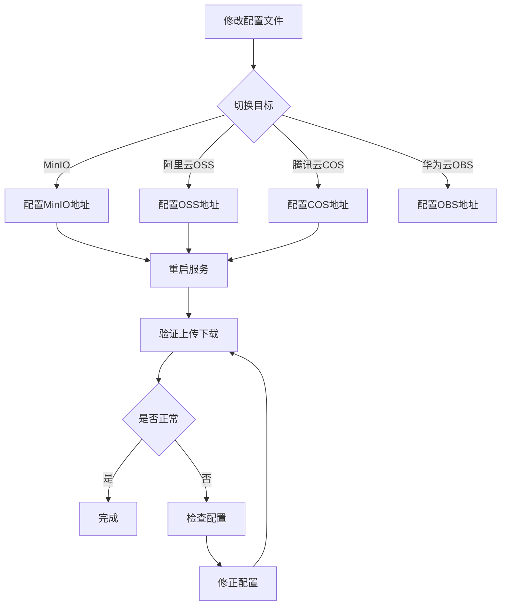

# 08-OSS切换

> 文件存储 - 本地/OSS/MinIO 切换

---

## ① Why - 价值 (为什么)

### 背景与痛点

企业在不同发展阶段需要不同的文件存储方案：

| 阶段 | 存储需求 | 推荐方案 |
|------|----------|----------|
| 开发测试 | 快速验证、成本低 | 本地存储 |
| 上线初期 | 小规模、低成本 | MinIO（自建对象存储） |
| 规模增长 | 高可用、大规模 | 阿里云OSS/腾讯云COS |
| 大规模 | 全球化、低成本 | 华为云OBS/AWS S3 |

**痛点**：
1. 切换存储需要修改大量代码
2. 不同云服务的API有差异，迁移成本高
3. 需要兼容不同云服务的特殊配置

### 业务场景

```
电商项目文件存储演进：
- V1.0：开发环境 → 本地存储（/data/uploads）
- V1.5：测试环境 → MinIO自建（192.168.1.100:9000）
- V2.0：生产环境 → 阿里云OSS（华东1）
- V3.0：多云备份 → 腾讯云COS（东南亚）

同一套代码，如何平滑切换？
```

---

## ② What - 定义 (是什么)

### 核心概念

| 概念 | 定义 |
|------|------|
| **S3协议** | Amazon Simple Storage Service协议的简称，AWS官方开源，是对象存储的事实标准 |
| **OSS** | Object Storage Service，对象存储服务（如阿里云OSS） |
| **MinIO** | 开源的对象存储服务器，兼容S3协议 |
| **预签名URL** | 带有临时访问权限的URL，用于直接上传/下载 |

### S3协议兼容性

```
主流S3兼容服务：
- 阿里云OSS ✓
- 腾讯云COS ✓
- 华为云OBS ✓
- MinIO ✓
- 七牛云 ✓
- AWS S3 ✓
- 京东云OSS ✓
```

---

## ③ How - 思维 (怎么做)

### 数据模型设计

#### S3配置表结构

```sql
-- 文件配置（S3相关字段）
ALTER TABLE infra_file_config ADD COLUMN storage INT DEFAULT 10;
ALTER TABLE infra_file_config ADD COLUMN config JSON;

-- S3配置JSON结构示例
{
  "endpoint": "oss-cn-hangzhou.aliyuncs.com",
  "bucket": "my-bucket",
  "accessKey": "LTAIxxxxx",
  "accessSecret": "xxxxx",
  "region": "cn-hangzhou",
  "domain": "https://my-bucket.oss-cn-hangzhou.aliyuncs.com",
  "enablePathStyleAccess": false,
  "enablePublicAccess": false
}
```

### 关键流程设计

#### 多云切换流程



#### Endpoint自动解析

```java
// S3FileClient中的自动解析逻辑
private String resolveRegion() {
    String endpoint = config.getEndpoint();
    
    // 1. 手动配置了region，直接使用
    if (StrUtil.isNotEmpty(config.getRegion())) {
        return config.getRegion();
    }
    
    // 2. 自动解析region
    if (endpoint.contains("amazonaws.com")) {
        return parseAwsRegion(endpoint);  // AWS
    }
    if (endpoint.contains("aliyuncs.com")) {
        return parseAliyunRegion(endpoint);  // 阿里云
    }
    if (endpoint.contains("myqcloud.com")) {
        return parseTencentRegion(endpoint);  // 腾讯云
    }
    
    // 3. 默认值
    return "us-east-1";
}
```

### 核心代码实现

#### 配置类定义

```java
/**
 * S3存储配置
 */
@Data
public class S3FileClientConfig extends FileClientConfig {
    
    /**
     * 节点地址
     * 阿里云：oss-cn-hangzhou.aliyuncs.com
     * 腾讯云：cos.ap-shanghai.myqcloud.com
     * MinIO：192.168.1.100:9000
     */
    private String endpoint;
    
    /**
     * bucket名称
     */
    private String bucket;
    
    /**
     * Access Key
     */
    private String accessKey;
    
    /**
     * Access Secret
     */
    private String accessSecret;
    
    /**
     * Region（可选，自动从endpoint解析）
     */
    private String region;
    
    /**
     * 自定义域名（可选）
     */
    private String domain;
    
    /**
     * 启用Path-style访问（MinIO需要true）
     */
    private Boolean enablePathStyleAccess;
    
    /**
     * 启用公开访问
     */
    private Boolean enablePublicAccess;
}
```

#### S3Client初始化

```java
@Override
protected void doInit() {
    // 1. 初始化domain
    if (StrUtil.isEmpty(config.getDomain())) {
        config.setDomain(buildDomain());
    }
    
    // 2. 创建S3Client
    String region = resolveRegion();
    AwsCredentialsProvider credentials = StaticCredentialsProvider.create(
        AwsBasicCredentials.create(config.getAccessKey(), config.getAccessSecret()));
    
    URI endpoint = URI.create(buildEndpoint());
    
    // 3. S3配置
    S3Configuration serviceConfig = S3Configuration.builder()
        .pathStyleAccessEnabled(Boolean.TRUE.equals(config.getEnablePathStyleAccess()))
        .chunkedEncodingEnabled(false)
        .build();
    
    // 4. 创建客户端
    client = S3Client.builder()
        .credentialsProvider(credentials)
        .region(Region.of(region))
        .endpointOverride(endpoint)
        .serviceConfiguration(serviceConfig)
        .build();
}
```

#### Domain构建策略

```java
// 不同云服务的Domain构建策略
private String buildDomain() {
    String endpoint = config.getEndpoint();
    
    // 1. 已经是完整URL（适配MinIO）
    if (HttpUtil.isHttp(endpoint) || HttpUtil.isHttps(endpoint)) {
        return endpoint + "/" + config.getBucket();
    }
    
    // 2. 阿里云格式：bucket.endpoint
    return "https://" + config.getBucket() + "." + endpoint;
}

// 使用示例
// 阿里云：https://my-bucket.oss-cn-hangzhou.aliyuncs.com
// 腾讯云：https://my-bucket.cos.ap-shanghai.myqcloud.com
// MinIO：http://192.168.1.100:9000/my-bucket
```

---

## ④ Hard - 难点 (挑战)

### 问题1：Path-style vs Virtual-host-style

**背景**：
- 阿里云OSS：Virtual-host-style（`bucket.endpoint`）默认
- MinIO：Path-style（`endpoint/bucket`）需要启用

**解决方案**：
```java
// 配置启用Path-style
S3Configuration.builder()
    .pathStyleAccessEnabled(true)  // MinIO需要
    .build();
```

### 问题2：不同云服务的Region解析

**场景**：如何从endpoint自动识别region？

**解决方案**：yudao-cloud的智能解析
```java
// AWS格式：s3.us-west-2.amazonaws.com
if (host.startsWith("s3.") && host.contains(".amazonaws.com")) {
    return host.substring(3, host.indexOf(".amazonaws.com"));
}

// 阿里云格式：oss-cn-hangzhou.aliyuncs.com
if (host.startsWith("oss-") && host.contains(".aliyuncs.com")) {
    return host.substring(4, host.indexOf(".aliyuncs.com"));
}

// 腾讯云格式：cos.ap-shanghai.myqcloud.com
if (host.startsWith("cos.") && host.contains(".myqcloud.com")) {
    return host.substring(4, host.indexOf(".myqcloud.com"));
}
```

### 问题3：公开访问 vs 私有访问

**场景**：文件需要公开访问还是私有访问？

**解决方案**：配置enblePublicAccess
```java
// 公开访问：返回直接URL
if (!BooleanUtil.isFalse(config.getEnablePublicAccess())) {
    return config.getDomain() + "/" + path;
}

// 私有访问：返回签名URL
return presigner.presignGetObject(...).url().toString();
```

### 问题4：文件迁移

**场景**：切换存储后，历史文件如何迁移？

**解决方案**：
```java
// 迁移脚本示例
@Service
public class FileMigrationService {
    
    @Autowired
    private FileClientFactory fileClientFactory;
    
    /**
     * 从源存储迁移到目标存储
     */
    public void migrate(Long sourceConfigId, Long targetConfigId) {
        FileClient source = fileClientFactory.getFileClient(sourceConfigId);
        FileClient target = fileClientFactory.getFileClient(targetConfigId);
        
        // 1. 获取所有文件
        List<FileDO> files = fileMapper.selectAll();
        
        // 2. 逐个迁移
        for (FileDO file : files) {
            try {
                // 2.1 下载
                byte[] content = source.getContent(file.getPath());
                
                // 2.2 上传
                target.upload(content, file.getPath(), file.getType());
                
                // 2.3 更新URL
                file.setUrl(target.getFileUrl(file.getPath()));
                fileMapper.updateById(file);
            } catch (Exception e) {
                log.error("文件迁移失败: {}", file.getId(), e);
            }
        }
    }
}
```

---

## ⑤ Metric - 衡量 (指标)

### 指标设计

| 指标 | 权重 | 说明 | 验证方法 |
|------|------|------|----------|
| 兼容性 | 30% | 兼容主流S3服务数量 | 逐一测试 |
| 自动解析 | 20% | region自动识别准确率 | 多endpoint测试 |
| 迁移能力 | 20% | 历史文件迁移支持 | 实际迁移测试 |
| 配置简化 | 15% | 最少配置项 | 配置项数量 |
| 性能 | 15% | 上传/下载速度 | 压测对比 |

### 测试矩阵

| 云服务 | endpoint | bucket | region | 自动解析 |
|--------|-----------|--------|--------|----------|
| 阿里云OSS | oss-cn-hangzhou.aliyuncs.com | test-bucket | cn-hangzhou | ✓ |
| 腾讯云COS | cos.ap-shanghai.myqcloud.com | test-bucket | ap-shanghai | ✓ |
| 华为云OBS | obs.cn-south-1.myhuaweicloud.com | test-bucket | cn-south-1 | ✓ |
| MinIO | 192.168.1.100:9000 | test-bucket | - | ✓ |

---

## ⑥ Select - 选型 (选哪个)

### 候选方案对比

| 方案 | 优点 | 缺点 | 适用场景 |
|------|------|------|----------|
| **S3协议（当前）** | 兼容性好，主流云都支持 | 需要理解S3配置 | 生产环境 |
| **SDK专用** | API更友好 | 切换成本高 | 单云环境 |
| **WebDAV** | 通用性好 | 性能较差 | 传统存储 |

### 选型理由

yudao-cloud选择**S3协议**，原因：
1. **一次开发，多处运行**：同一套代码切换云服务
2. **社区成熟**：S3是对象存储事实标准
3. **MinIO兼容**：开发测试可以使用MinIO
4. **迁移成本低**：切换只需改配置

---

## ⑦ Impl - 实现 (细节)

### yudao-cloud中的配置

#### 配置文件示例

```yaml
# application-local.yml (MinIO)
yudao:
  file:
    config:
      - id: 1
        name: MinIO存储
        storage: 20  # S3
        config: >
          {
            "endpoint": "http://192.168.1.100:9000",
            "bucket": "yudao",
            "accessKey": "minioadmin",
            "accessSecret": "minioadmin",
            "enablePathStyleAccess": true,
            "enablePublicAccess": true
          }

# application-prod.yml (阿里云OSS)
yudao:
  file:
    config:
      - id: 1
        name: 阿里云OSS
        storage: 20
        config: >
          {
            "endpoint": "oss-cn-hangzhou.aliyuncs.com",
            "bucket": "yudao-prod",
            "accessKey": "${OSS_ACCESS_KEY}",
            "accessSecret": "${OSS_ACCESS_SECRET}",
            "enablePathStyleAccess": false,
            "enablePublicAccess": true
          }
```

#### 环境变量配置

```bash
# 环境变量（生产环境）
export OSS_ACCESS_KEY=LTAIxxxxx
export OSS_ACCESS_SECRET=xxxxx
```

### 关键步骤校验

| 步骤 | 校验点 | 验证方法 |
|------|--------|----------|
| 1 | 配置正确性 | 检查endpoint/bucket可访问 |
| 2 | 上传成功 | 调用接口上传文件，检查返回URL |
| 3 | 下载成功 | 访问URL下载文件 |
| 4 | 删除成功 | 删除后检查文件不存在 |
| 5 | 签名URL | 私有模式检查签名有效性 |

### S3服务对比

| 服务 | endpoint格式 | 特别配置 |
|------|--------------|----------|
| 阿里云OSS | `oss-cn-hangzhou.aliyuncs.com` | 需要开启cors |
| 腾讯云COS | `cos.ap-shanghai.myqcloud.com` | 需要设置cors |
| 华为云OBS | `obs.cn-south-1.myhuaweicloud.com` | - |
| MinIO | `192.168.1.100:9000` | pathStyle=true |
| 七牛云 | `s3-cn-south-1.qiniucs.com` | 需要自定义domain |

---

## ⑧ SKILL - 提炼 (复用)

### 触发条件

```
场景1：需要切换不同的对象存储服务
场景2：从MinIO迁移到云存储
场景3：需要同时支持多云存储
```

### 执行流程

```
Step 1: 添加S3依赖
  - software.amazon.awssdk:s3

Step 2: 配置endpoint
  - 阿里云：oss-cn-hangzhou.aliyuncs.com
  - 腾讯云：cos.ap-shanghai.myqcloud.com
  - MinIO：http://192.168.1.100:9000

Step 3: 配置认证信息
  - accessKey / accessSecret

Step 4: 选择访问模式
  - 公开访问：enablePublicAccess=true
  - 私有访问：enablePublicAccess=false

Step 5: 验证
  - 上传/下载/删除测试
```

### 配方/素材

**Maven依赖**：
```xml
<dependency>
    <groupId>software.amazon.awssdk</groupId>
    <artifactId>s3</artifactId>
    <version>2.20.0</version>
</dependency>
```

**最小配置项**：
```json
{
  "endpoint": " oss-cn-hangzhou.aliyuncs.com",
  "bucket": "my-bucket",
  "accessKey": "LTAIxxxxx",
  "accessSecret": "xxxxx"
}
```

### 验收标准

```
- [ ] MinIO连接正常
- [ ] 阿里云OSS连接正常
- [ ] 腾讯云COS连接正常
- [ ] 切换配置可正常工作
- [ ] 文件迁移工具可用
```

---

## 附录：CORS配置

### 阿里云OSS CORS

```xml
<!-- 允许的来源 -->
<CORSConfiguration>
    <CORSRule>
        <AllowedOrigin>*</AllowedOrigin>
        <AllowedMethod>GET</AllowedMethod>
        <AllowedMethod>PUT</AllowedMethod>
        <AllowedMethod>POST</AllowedMethod>
        <AllowedHeader>*</AllowedHeader>
    </CORSRule>
</CORSConfiguration>
```

### MinIO CORS

```bash
# 启动MinIO时配置cors
minio server /data --cors "*"
```

---

## 参考资料

1. yudao-cloud文件模块：https://gitee.com/yudaocode/yudao-cloud
2. AWS S3 SDK：https://sdk.amazonaws.com/java/latest/
3. S3协议文档：https://docs.aws.amazon.com/s3/
4. MinIO CORS：https://min.io/docs/minio/linux/ops/monitoring/grid-release.html