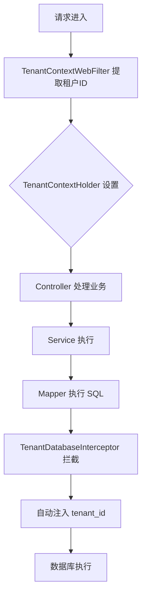

# SaaS多租户 - 多租户模型与数据隔离

> 学习日期：2026-04-17
> 任务编号：13
> 状态：✅ 已完成

---

## ① Why - 价值 (为什么)

### 背景与痛点

- **痛点1**：多个企业共用一套系统，数据如何隔离？
- **痛点2**：如何控制不同企业的功能权限？
- **痛点3**：租户如何管理自己的用户和配置？

### 收益

- **数据隔离**：租户间数据互不可见，安全性有保障
- **功能管控**：通过套餐控制每个租户的功能模块
- **灵活配置**：支持自定义域名、过期时间、账号数量

### 用户

- SaaS 运营商、租户管理员

---

## ② What - 定义 (是什么)

### 一句话定义

通过 MyBatis Plus 租户拦截器实现数据库层面的多租户数据隔离，每个租户拥有独立的套餐配置。

### 核心组成

| 组成 | 说明 |
|------|------|
| 租户 | 真实使用系统的企业/组织 |
| 租户套餐 | 功能模块权限集合 |
| 租户拦截器 | 自动注入租户 ID |

### 关键术语

- `tenant_id` - 租户 ID，多租户表自动注入
- `@TenantIgnore` - 忽略多租户注解
- `TenantBaseDO` - 多租户 DO 基类
- `TenantPackageDO` - 租户套餐

---

## ③ How - 思维 (怎么做)

### 目标

实现多租户数据隔离，支持按套餐控制功能权限

### 范围

- **允许**：`yudao-framework/yudao-spring-boot-starter-biz-tenant/`
- **允许**：`yudao-module-system/tenant/`
- **禁止**：修改业务模块表结构

### 禁止事项

- 禁止手动插入 `tenant_id` 字段
- 禁止绕过拦截器查询

### 数据模型

#### TenantDO - 租户表

```java
// 文件位置：yudao-module-system/yudao-module-system-server/src/main/java/cn/iocoder/yudao/module/system/dal/dataobject/tenant/TenantDO.java

@TableName("system_tenant")
public class TenantDO extends BaseDO {

    // 系统内置套餐
    public static final Long PACKAGE_ID_SYSTEM = 0L;

    private Long id;              // 租户ID
    private String name;          // 租户名
    private Long contactUserId;  // 联系人用户ID
    private String contactName;  // 联系人姓名
    private String contactMobile; // 联系手机
    private Integer status;     // 状态(0禁用1启用)
    private List<String> websites; // 绑定域名
    private Long packageId;      // 套餐ID
    private LocalDateTime expireTime; // 过期时间
    private Integer accountCount; // 账号数量
}
```

#### TenantPackageDO - 租户套餐表

```java
// 文件位置：yudao-module-system/yudao-module-system-server/src/main/java/cn/iocoder/yudao/module/system/dal/dataobject/tenant/TenantPackageDO.java

@TableName("system_tenant_package")
public class TenantPackageDO extends BaseDO {

    private Long id;              // 套餐ID
    private String name;          // 套餐名
    private Integer status;         // 状态
    private String remark;       // 备注
    private Set<Long> menuIds;   // 菜单ID集合
}
```

### 关键流程图



### Key Classes

| 类 | 职责 |
|------|------|
| `TenantContextHolder` | 租户上下文持有者 |
| `TenantDatabaseInterceptor` | MyBatis Plus 拦截器 |
| `TenantBaseDO` | 多租户 DO 基类 |
| `@TenantIgnore` | 忽略多租户注解 |
| `TenantService` | 租户管理服务 |

---

## ④ Hard - 难点 (挑战)

### 难点1：非租户表如何处理？

**场景**：系统表如用户表、部门表需要区分租户

**解决方案**：

```java
// 继承 TenantBaseDO，自动注入 tenant_id
public class AdminUserDO extends TenantBaseDO {
    // ...
}

// 或添加 @TenantIgnore 注解忽略
@TenantIgnore
public class TenantDO extends BaseDO {
    // 不注入租户ID
}
```

### 难点2：跨租户查询

**场景**：超级管理员需要查看所有租户数据

**解决方案**：

```java
// 使用 @TenantIgnore 注解
@TenantIgnore
public List<TenantDO> getAllTenants() {
    // 查询所有租户
}
```

### 难点3：租户套餐权限控制

**场景**：不同租户拥有不同功能模块

**解决方案**：

```java
// TenantPackageDO.menuIds 存储菜单ID集合
// 登录时加载套餐权限，写入 TenantContextHolder
Set<Long> menuIds = tenantPackage.getMenuIds();
TenantContextHolder.setMenuIds(menuIds);
```

### 难点4：数据隔离验证

**场景**：确保租户A看不到租户B的数据

**解决方案**：

```sql
-- 拦截器自动改写 SQL
SELECT * FROM system_user
-- 改为
SELECT * FROM system_user WHERE tenant_id = 1
```

---

## ⑤ Metric - 衡量 (指标)

| 指标 | 权重 | 说明 | 验证方法 |
|------|------|------|----------|
| 数据隔离完整率 =100% | 30% | 所有租户数据不可见 | 跨租户查询测试 |
| 查询性能影响 <5% | 25% | 拦截器开销 | 压测对比 |
| 套餐权限控制 | 25% | 功能可配置 | 后台配置测试 |
| 租户管理功能 | 20% | CR 完整 | 后台操作测试 |

### 验证脚本

```sql
-- 查看租户列表
SELECT * FROM system_tenant;

-- 查看套餐
SELECT * FROM system_tenant_package;

-- 测试数据隔离（租户1）
SELECT * FROM system_user WHERE tenant_id = 1;
-- 应只能看到 tenant_id=1 的数据
```

---

## ⑥ Select - 选型 (选哪个)

### 候选方案对比

| 方案 | 优点 | 缺点 | 适用场景 |
|------|------|------|----------|
| DB 隔离 | 简单、性能好 | 需要应用改造 | 多租户 SaaS |
| Schema 隔离 | 完全隔离 | 资源成本高 | 极高安全要求 |
| 行级隔离 | 实现简单 | 需改写 SQL | 多租户应用 |

### 选型理由

选择 **MyBatis Plus 行级租户隔离**，因为：

1. **零成本** - 拦截器自动注入，无需改写业务代码
2. **高性能** - 仅一个 WHERE 条件
3. **灵活** - 支持忽略特定表/方法

---

## ⑦ Impl - 实现 (细节)

### 核心代码 - TenantDatabaseInterceptor

```java
// 文件位置：yudao-framework/yudao-spring-boot-starter-biz-tenant/.../TenantDatabaseInterceptor.java

public class TenantDatabaseInterceptor implements TenantLineHandler {

    @Override
    public Expression getTenantId() {
        // 从上下文获取租户ID
        return new LongValue(TenantContextHolder.getRequiredTenantId());
    }

    @Override
    public boolean ignoreTable(String tableName) {
        // 1. 全局忽略
        if (TenantContextHolder.isIgnore()) {
            return true;
        }
        // 2. 继承 TenantBaseDO 的表不忽略
        if (TenantBaseDO.class.isAssignableFrom(tableInfo.getEntityType())) {
            return false;
        }
        // 3. @TenantIgnore 注解
        return tenantIgnore != null;
    }
}
```

### 核心代码 - TenantBaseDO

```java
// 文件位置：yudao-framework/yudao-spring-boot-starter-biz-tenant/.../TenantBaseDO.java

@TenantIgnore
public abstract class TenantBaseDO extends BaseDO {

    /**
     * 租户编号
     * 自动填充，由 TenantDatabaseInterceptor 注入
     */
    private Long tenantId;
}
```

### 配置文件

```yaml
# application.yml
yudao:
  tenant:
    ignore-tables:
      - system_tenant
      - system_tenant_package
      - system_menu
      - system_dict_data
```

### 执行流程

```
Step 1: 请求进入
  → TenantContextWebFilter 从 Header/Cookie 提取 tenant_id

Step 2: 设置上下文
  → TenantContextHolder.setTenantId(1L)

Step 3: 业务执行
  → Mapper 执行 SELECT * FROM system_user

Step 4: SQL 改写
  → TenantDatabaseInterceptor 注入 WHERE tenant_id = 1

Step 5: 数据库执行
  → SELECT * FROM system_user WHERE tenant_id = 1
```

---

## ⑧ SKILL - 提炼 (复用)

### 触发条件

- 场景1：需要实现多租户 SaaS
- 场景2：需要数据隔离
- 场景3：需要套餐权限控制

### 执行流程

```
Step 1: 引入依赖
  - yudao-spring-boot-starter-biz-tenant

Step 2: 实体类继承
  - 继承 TenantBaseDO

Step 3: 配置忽略表
  - yudao.tenant.ignore-tables

Step 4: 使用 @TenantIgnore
  - 需要跨租户查询的方法
```

### 配方

- **租户 ID**：Long 类型，从上下文获取
- **套餐控制**：通过 menuIds 控制菜单权限
- **过期控制**：expireTime 字段

### 验收标准

- [x] 多租户数据自动隔离
- [x] 跨租户查询可控制
- [x] 套餐权限可配置
- [x] 租户管理完整

---

## 参考资料

- [芋道源码 - 多租户](https://doc.iocoder.cn/tenant/)
- [MyBatis Plus 多租户](https://baomidou.com/reference/tenant-line/)