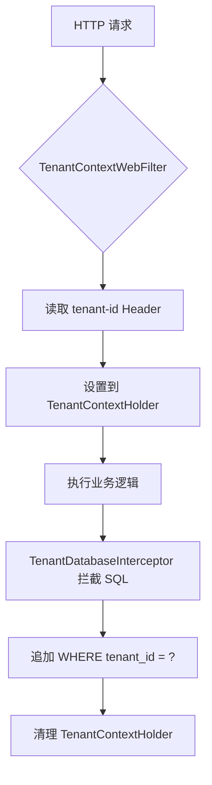
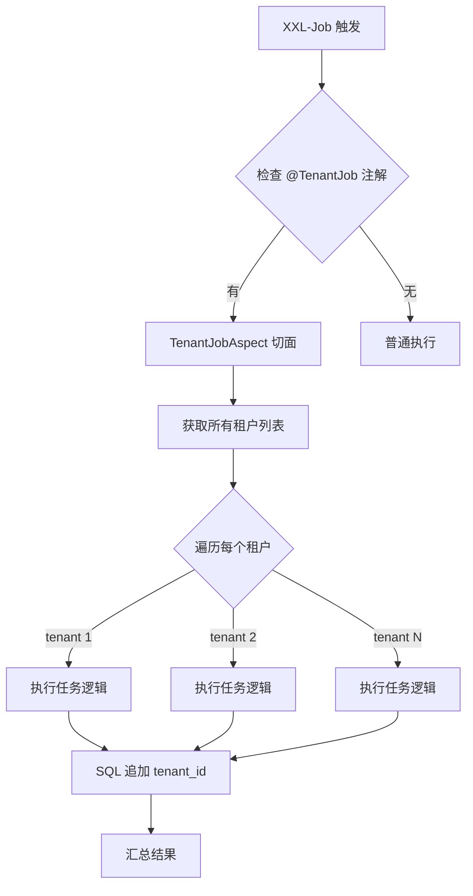

# 15-API租户识别.md

> 本文档基于八步法分析 SaaS 多租户场景下的 API 租户识别与定时任务租户处理

---

## ① Why - 价值 (为什么)

### 背景与痛点

在 SaaS 多租户系统中，除了数据库层面的租户拦截（任务14），还有两个关键场景需要处理：

1. **API 请求的租户识别**：微服务架构中，API 请求如何知道是哪个租户发起的？特别是回调接口（支付回调、短信回调）没有登录信息。
2. **定时任务的租户处理**：定时任务（如支付订单过期关闭）没有请求上下文，如何为每个租户独立执行？

### 收益

- **API 层面**：支持有登录（Header 带 token）和无登录（Header 带 tenant-id）的请求
- **定时任务**：自动遍历所有租户，为每个租户执行任务，确保数据隔离
- **跨租户访问**：超级管理员可切换到指定租户进行管理

### 使用者

- 后端开发工程师
- 运维人员（配置定时任务）

---

## ② What - 定义 (是什么)

### 一句话定义

通过请求 Header 解析租户 ID（支持登录用户和匿名回调），并为定时任务配备 `@TenantJob` 注解自动为每个租户执行任务。

### 核心组成

| 组件 | 职责 |
|------|------|
| `TenantContextWebFilter` | 从 Header 解析 tenant-id，设置到上下文 |
| `TenantVisitContextInterceptor` | 处理跨租户访问（visit-tenant-id） |
| `@TenantJob` 注解 | 标记定时任务需要多租户执行 |
| `TenantJobAspect` | AOP 切面，遍历所有租户执行任务 |
| `TenantFrameworkService` | 提供租户列表查询服务 |

### 关键术语

- **tenant-id**：请求 Header，用于标识请求属于哪个租户
- **visit-tenant-id**：请求 Header，用于超级管理员切换租户
- **TenantJob**：注解，标记 XXL-Job 任务需要为每个租户执行

---

## ③ How - 思维 (怎么做)

### API 租户识别流程

```
HTTP 请求进入
    │
    ▼
TenantContextWebFilter.doFilterInternal()
    │
    ├── 读取 Header: tenant-id
    ├── 读取 Header: visit-tenant-id (可选，跨租户)
    │
    ▼
TenantContextHolder.setTenantId(tenantId)
    │
    ▼
Controller / Service / Mapper 执行
    │
    ▼
TenantDatabaseInterceptor 拦截 SQL
    追加 WHERE tenant_id = ?
    │
    ▼
TenantContextHolder.clear() (请求结束后清理)
```

### 定时任务租户执行流程

```
XXL-Job 调度中心触发
    │
    ▼
@XxlJob("payOrderExpireJob") + @TenantJob
    │
    ▼
TenantJobAspect.around() AOP 切面
    │
    ▼
TenantFrameworkService.getTenantIds() 获取所有租户列表
    │
    ├── forEach 遍历每个 tenantId
    │       │
    │       ▼
    │   TenantUtils.execute(tenantId, () -> {
    │       // 为该租户执行任务逻辑
    │       // SQL 自动追加 tenant_id 条件
    │   })
    │
    ▼
汇总执行结果，返回成功/失败
```

### 核心代码

**1. TenantContextWebFilter 解析租户**

```java
// TenantContextWebFilter.java
protected void doFilterInternal(HttpServletRequest request, HttpServletResponse response, FilterChain chain) {
    // 从 Header 解析 tenant-id
    Long tenantId = WebFrameworkUtils.getTenantId(request);
    if (tenantId != null) {
        TenantContextHolder.setTenantId(tenantId);
    }
    try {
        chain.doFilter(request, response);
    } finally {
        TenantContextHolder.clear(); // 清理，避免内存泄漏
    }
}

// WebFrameworkUtils.java
public static Long getTenantId(HttpServletRequest request) {
    String tenantId = request.getHeader("tenant-id");
    return NumberUtil.isNumber(tenantId) ? Long.valueOf(tenantId) : null;
}
```

**2. 跨租户访问拦截器**

```java
// TenantVisitContextInterceptor.java
public boolean preHandle(HttpServletRequest request, HttpServletResponse response, Object handler) {
    // 读取 visit-tenant-id（管理员切换租户）
    Long visitTenantId = WebFrameworkUtils.getVisitTenantId(request);
    if (visitTenantId != null) {
        // 校验权限：必须有 system:tenant:visit 权限
        if (!securityFrameworkService.hasAnyPermissions("system:tenant:visit")) {
            throw new Exception("您无权切换租户");
        }
        // 切换到目标租户
        TenantContextHolder.setTenantId(visitTenantId);
    }
    return true;
}
```

**3. @TenantJob 注解使用**

```java
@Component
public class PayOrderExpireJob {

    @XxlJob("payOrderExpireJob")
    @TenantJob  // 关键：标记该任务需要为每个租户执行
    public String execute(String param) {
        int count = orderService.expireOrder();
        return StrUtil.format("支付过期 ({}) 个", count);
    }
}
```

**4. TenantJobAspect 切面逻辑**

```java
@Around("@annotation(tenantJob)")
public void around(ProceedingJoinPoint joinPoint, TenantJob tenantJob) {
    // 1. 获取所有租户列表
    List<Long> tenantIds = tenantFrameworkService.getTenantIds();
    
    // 2. 并行遍历每个租户执行任务
    tenantIds.parallelStream().forEach(tenantId -> {
        TenantUtils.execute(tenantId, () -> {
            // 执行任务逻辑，SQL 会自动追加 tenant_id
            joinPoint.proceed();
        });
    });
    
    // 3. 返回执行结果
}
```

---

## ④ Hard - 难点 (挑战)

### 难点1：回调接口没有登录信息

**问题**：支付回调、短信回调等接口没有登录用户，如何识别租户？

**解决方案**：通过 `tenant-id` Header 传递租户 ID，这类接口需要在 Nginx/网关层配置传递。

### 难点2：定时任务如何获取租户列表

**问题**：定时任务没有请求上下文，如何知道系统有哪些租户？

**解决方案**：
- `TenantFrameworkService.getTenantIds()` 从数据库查询所有租户
- 只有"开启"状态的租户才会执行任务

### 难点3：任务执行失败处理

**问题**：假设有 10 个租户，任务执行到第 8 个时失败了，前 7 个已经成功，怎么办？

**解决方案**：
- `TenantJobAspect` 使用 `parallelStream` 并行执行
- 失败会记录到结果中，返回 `handleFail`
- 需要保证任务的幂等性，支持重试

### 难点4：跨租户访问权限控制

**问题**：普通用户能否切换到其他租户？

**解决方案**：
- 必须拥有 `system:tenant:visit` 权限
- `TenantVisitContextInterceptor` 校验权限后切换

### 难点5：异步任务上下文传递

**问题**：定时任务内部如果有异步线程池，租户上下文能否传递？

**解决方案**：使用 `TransmittableThreadLocal`，确保异步任务也能获取租户 ID。

---

## ⑤ Metric - 衡量 (指标)

| 指标 | 权重 | 说明 | 验证方法 |
|------|------|------|----------|
| API 租户识别准确率 | 25% | Header 正确解析 | 打印 TenantContextHolder |
| 定时任务覆盖完整 | 25% | 所有租户都执行 | 日志确认遍历租户数 |
| 跨租户权限控制 | 15% | 无权限用户无法切换 | 权限测试 |
| 任务执行幂等性 | 20% | 重试不重复执行 | 手动重试测试 |
| 异常处理正确性 | 15% | 部分失败不影响其他 | 模拟失败测试 |

---

## ⑥ Select - 选型 (选哪个)

### 候选方案对比

| 方案 | 优点 | 缺点 | 适用场景 |
|------|------|------|----------|
| Header 传递 tenant-id | 简单、明确 | 需要网关配合 | 绝大多数场景 |
| 从 Token 解析 | 无需额外 Header | 解析逻辑复杂 | 已登录用户 |
| URL 路径包含租户 | 直观 | 污染 URL | 微服务内部调用 |

### 选型理由

选择 **Header 传递 tenant-id**，因为：
1. 解耦登录状态，匿名接口（如回调）也能识别租户
2. yudao-cloud 已原生支持，配置简单
3. 可与 `visit-tenant-id` 配合，实现跨租户访问

---

## ⑦ Impl - 实现 (细节)

### 核心类清单

| 类 | 路径 | 职责 |
|---|---|---|
| TenantContextWebFilter | `framework/tenant/.../web/` | 从 Header 解析租户 ID |
| TenantVisitContextInterceptor | `framework/tenant/.../web/` | 处理跨租户访问 |
| TenantJob | `framework/tenant/.../job/` | 定时任务注解 |
| TenantJobAspect | `framework/tenant/.../job/` | 遍历租户执行任务 |
| TenantFrameworkService | `framework/tenant/.../service/` | 提供租户列表 |

### 配置示例

```yaml
yudao:
  tenant:
    enable: true
    ignore-urls:
      - /api/notify/callback  # 回调接口通常也要带 tenant-id
      - /api/pay/callback
```

### 使用步骤

**Step 1: API 请求传递租户 ID**
- 登录用户：Token 中包含 tenant-id
- 匿名请求：Header 手动传递 `tenant-id: 1`

**Step 2: 定时任务添加 @TenantJob**
```java
@XxlJob("demoJob")
@TenantJob  // 关键！
public void execute() { }
```

**Step 3: 跨租户访问（可选）**
- Header 传递 `visit-tenant-id: 2`
- 需要 `system:tenant:visit` 权限

### 校验步骤

```
Step 1: 检查 API 租户识别
  → 校验点：Controller 获取 TenantContextHolder.getTenantId()
  → 验证方法：打印日志

Step 2: 检查定时任务多租户执行
  → 校验点：日志显示遍历了所有租户
  → 验证方法：XXL-Job 日志

Step 3: 检查跨租户访问
  → 校验点：无权限用户访问返回 403
  → 验证方法：权限测试

Step 4: 检查任务幂等性
  → 校验点：重试后数据不重复
  → 验证方法：数据库查询
```

---

## ⑧ SKILL - 提炼 (复用)

### 触发条件

```
场景1：开发新的回调接口（支付/短信）
场景2：新增定时任务需要多租户执行
场景3：超级管理员需要查看某个租户数据
场景4：排查租户上下文丢失问题
```

### 执行流程

```
Step 1: 确认接口类型
  → 登录用户：自动从 Token 解析
  → 匿名接口：Header 传递 tenant-id

Step 2: 定时任务添加注解
  → @XxlJob + @TenantJob 同时使用

Step 3: 跨租户访问（如需要）
  → Header 传递 visit-tenant-id
  → 校验权限 system:tenant:visit

Step 4: 验证
  → 打印 TenantContextHolder 确认
```

### 配方

**技术栈**：Java 8+, Spring Boot 2.7+, XXL-Job
**依赖包**：`yudao-spring-boot-starter-biz-tenant`
**注解**：`@TenantJob`

### 验收标准

```
- [ ] API 请求正确解析 tenant-id
- [ ] 定时任务为所有租户执行
- [ ] 跨租户访问权限控制生效
- [ ] 任务执行失败正确处理
- [ ] 支持匿名接口（回调）租户识别
```

---

## 附录：流程图

### API 租户识别流程



### 定时任务多租户执行流程

