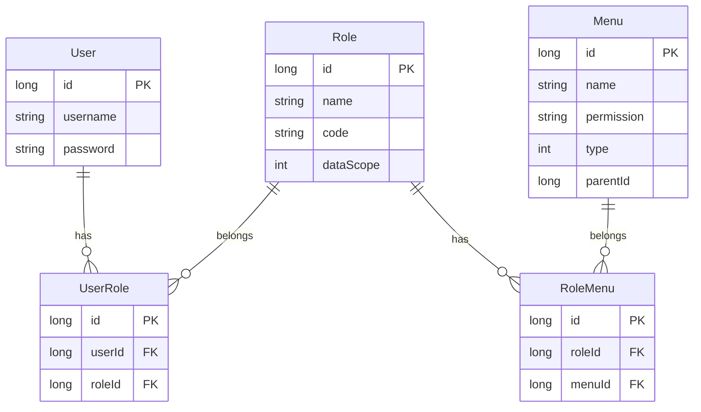

# 16-RBAC权限模型.md

> 本文档基于八步法分析 RBAC（Role-Based Access Control）权限模型在 yudao-cloud 中的设计与实现

---

## ① Why - 价值 (为什么)

### 背景与痛点

在企业管理系统中，权限控制是核心功能。如果没有统一的权限模型，会面临：

1. **权限管理混乱**：每个接口单独校验权限，难以维护
2. **角色分配困难**：无法批量给用户分配权限
3. **数据泄露风险**：用户可能访问不该看的数据

### 收益

- **权限精细化**：基于角色分配权限，支持菜单、按钮、数据级别控制
- **维护简单**：修改角色权限，所有关联用户自动生效
- **审计友好**：权限分配记录清晰，可追溯

### 使用者

- 系统管理员（分配角色）
- 开发工程师（配置权限）
- 普通用户（按角色获取权限）

---

## ② What - 定义 (是什么)

### 一句话定义

RBAC（基于角色的访问控制）通过角色作为用户与权限的中间层，实现灵活的权限分配与管理。

### 核心概念

| 概念 | 说明 | 示例 |
|------|------|------|
| **用户（User）** | 系统使用者 | 员工账号 |
| **角色（Role）** | 一组权限的集合 | 部门经理、财务 |
| **权限（Permission）** | 对资源的操作资格 | 查看、编辑、删除 |
| **菜单（Menu）** | 资源入口 | 用户管理页面 |

### yudao-cloud 中的 RBAC 模型

```
┌──────────┐       ┌──────────┐       ┌──────────┐
│   User   │──────>│   Role   │──────>│   Menu   │
└──────────┘       └──────────┘       └──────────┘
       │                 │                   │
       │                 │                   │
       ▼                 ▼                   ▼
┌──────────┐       ┌──────────┐       ┌──────────┐
│UserRoleDO│       │  RoleDO  │       │ Permission│
└──────────┘       └──────────┘       │  (Menu)  │
       │                 │            └──────────┘
       │                 │
       ▼                 ▼
┌──────────────────────────────────────┐
│           RoleMenuDO                  │
│    (角色-菜单关联，支持多对多)         │
└──────────────────────────────────────┘
```

---

## ③ How - 思维 (怎么做)

### 数据模型设计

#### 1. 角色表 (system_role)

```java
// RoleDO.java
@TableName("system_role")
public class RoleDO extends TenantBaseDO {
    private Long id;           // 角色ID
    private String name;       // 角色名称
    private String code;       // 角色标识（如 admin、manager）
    private Integer sort;      // 排序
    private Integer status;    // 状态（启用/禁用）
    private Integer type;      // 角色类型（系统/自定义）
    private Integer dataScope; // 数据范围
    private Set<Long> dataScopeDeptIds; // 指定部门（数据权限）
    private String remark;     // 备注
}
```

#### 2. 菜单表 (system_menu)

```java
// MenuDO.java
@TableName("system_menu")
@TenantIgnore  // 菜单是全局共享的，不按租户隔离
public class MenuDO extends BaseDO {
    private Long id;           // 菜单ID
    private String name;       // 菜单名称
    private String permission; // 权限标识（system:user:add）
    private Integer type;      // 类型（目录/菜单/按钮）
    private Integer sort;      // 排序
    private Long parentId;     // 父菜单ID
    private String path;       // 路由路径
    private String icon;       // 图标
    private String component;  // 组件路径
    private Integer status;    // 状态
    private Boolean visible;   // 是否可见
    private Boolean keepAlive; // 是否缓存
    private Boolean alwaysShow;// 是否总是显示
}
```

#### 3. 关联表

```java
// 用户-角色关联
@TableName("system_user_role")
public class UserRoleDO extends BaseDO {
    private Long userId;  // 用户ID
    private Long roleId;  // 角色ID
}

// 角色-菜单关联（支持多对多）
@TableName("system_role_menu")
public class RoleMenuDO extends TenantBaseDO {
    private Long roleId;  // 角色ID
    private Long menuId;  // 菜单ID
}
```

### 关键流程

#### 权限校验流程

```
用户请求 -> Security 过滤器 -> 
    获取用户角色 -> 
        获取角色菜单/权限 -> 
            检查接口是否需要权限 -> 
                有权限：放行 | 无权限：拒绝
```

#### 数据权限流程

```
用户查询数据 -> DataPermissionInterceptor 拦截 ->
    获取用户角色及 dataScope ->
        根据范围拼接 SQL 条件 ->
            WHERE dept_id IN (指定部门) 或 dept_id = 所属部门
```

---

## ④ Hard - 难点 (挑战)

### 难点1：菜单类型区分

**问题**：菜单、目录、按钮、接口，如何区分？

**解决方案**：通过 `MenuTypeEnum` 枚举区分：
- `DICTIONARY(0)`：字典目录
- `DICTIONARY_ITEM(1)`：字典项
- `MENU_DIR(2)`：菜单目录
- `MENU(3)`：菜单
- `BUTTON(4)`：按钮
- `API(5)`：接口

### 难点2：数据权限控制

**问题**：不同角色能看到不同范围的数据，如何实现？

**解决方案**：`DataScopeEnum` 枚举定义 5 种数据范围：
- `ALL`：全部数据
- `DEPT_CUSTOM`：指定部门（自定义）
- `DEPT_ONLY`：仅所在部门
- `DEPT_AND_CHILD`：所在部门及子部门
- `SELF`：仅本人数据

### 难点3：租户与权限隔离

**问题**：菜单是否需要租户隔离？

**解决方案**：使用 `@TenantIgnore` 注解，菜单全局共享，不按租户隔离；角色和用户-角色关联需要隔离。

### 难点4：超级管理员

**问题**：谁可以管理所有权限？

**解决方案**：通过 `RoleTypeEnum` 区分系统角色和自定义角色，系统角色不可删除。

---

## ⑤ Metric - 衡量 (指标)

| 指标 | 权重 | 说明 | 验证方法 |
|------|------|------|----------|
| 角色分配准确性 | 25% | 用户角色正确 | 数据库查询 |
| 菜单权限控制 | 25% | 有权限访问/无权限拒绝 | 接口测试 |
| 数据权限过滤 | 20% | SQL 正确追加条件 | 打印 SQL 日志 |
| 菜单层级正确 | 15% | 父子关系正确 | UI 展示验证 |
| 权限分配记录 | 15% | 分配日志可查 | 审计日志 |

---

## ⑥ Select - 选型 (选哪个)

### 候选方案对比

| 方案 | 优点 | 缺点 | 适用场景 |
|------|------|------|----------|
| RBAC（当前方案） | 解耦灵活、社区成熟 | 需要额外维护角色表 | 绝大多数管理系统 |
| ABAC | 动态策略、细粒度 | 复杂度高 | 复杂权限场景 |
| ACL | 简单直接 | 扩展性差 | 小型系统 |

### 选型理由

选择 **RBAC**，因为：
1. yudao-cloud 已原生实现，集成成本低
2. 支持菜单、按钮、数据多级别控制
3. 角色与用户解耦，权限管理灵活
4. 与 Spring Security 深度集成

---

## ⑦ Impl - 实现 (细节)

### 核心类清单

| 类 | 路径 | 职责 |
|---|---|---|
| RoleDO | `system/.../dal/dataobject/permission/` | 角色实体 |
| MenuDO | `system/.../dal/dataobject/permission/` | 菜单实体 |
| UserRoleDO | `system/.../dal/dataobject/permission/` | 用户-角色关联 |
| RoleMenuDO | `system/.../dal/dataobject/permission/` | 角色-菜单关联 |
| DataScopeEnum | `system/.../enums/permission/` | 数据范围枚举 |

### 关键代码

**1. 菜单实体定义**

```java
@TenantIgnore  // 菜单全局共享，不按租户隔离
@TableName("system_menu")
public class MenuDO extends BaseDO {
    private String permission; // 权限标识，如 system:user:add
    
    @MenuTypeEnum
    private Integer type;      // 菜单类型
}
```

**2. 角色数据权限**

```java
// 角色配置数据范围
private Integer dataScope; // 1=全部 2=自定义部门 3=仅部门 4=部门及子级 5=仅本人
private Set<Long> dataScopeDeptIds; // 自定义部门列表
```

**3. 权限校验注解**

```java
// 后端接口权限校验
@PreAuthorize("@ss.hasPermission('system:user:query')")
public void getUser(Long id) { }

// 前端按钮权限控制
<el-button v-if="hasPermission('system:user:delete')">
    删除
</el-button>
```

### 校验步骤

```
Step 1: 检查角色创建
  → 校验点：RoleDO 数据正确
  → 验证方法：数据库查询

Step 2: 检查用户角色分配
  → 校验点：UserRoleDO 关联正确
  → 验证方法：查询用户角色

Step 3: 检查菜单权限
  → 校验点：RoleMenuDO 关联正确
  → 验证方法：角色关联的菜单

Step 4: 检查数据权限
  → 校验点：查询自动追加 dept 条件
  → 验证方法：SQL 日志

Step 5: 检查接口权限
  → 校验点：无权限返回 403
  → 验证方法：接口测试
```

---

## ⑧ SKILL - 提炼 (复用)

### 触发条件

```
场景1：新建业务模块，需要配置权限
场景2：新增角色，分配菜单权限
场景3：排查用户无权限访问问题
场景4：配置数据权限（部门级控制）
```

### 执行流程

```
Step 1: 定义菜单
  → 在 system_menu 表添加菜单记录
  → 配置 permission 标识
  → 配置 type（目录/菜单/按钮）

Step 2: 创建角色
  → 在 system_role 表添加角色
  → 配置 dataScope 数据范围

Step 3: 分配权限
  → 在 system_role_menu 关联菜单
  → 在 system_user_role 关联用户

Step 4: 权限校验
  → 后端：@PreAuthorize 注解
  → 前端：v-if="hasPermission()"
```

### 配方

**技术栈**：Spring Security + MyBatis Plus
**配置表**：
- `system_role` - 角色表
- `system_menu` - 菜单表
- `system_user_role` - 用户角色关联
- `system_role_menu` - 角色菜单关联

### 验收标准

```
- [ ] 角色创建成功，可分配给用户
- [ ] 菜单配置正确，层级关系清晰
- [ ] 有权限用户可访问，无权限拒绝
- [ ] 数据权限按部门过滤
- [ ] 租户隔离正确（角色关联租户，菜单共享）
```

---

## 附录：数据模型 ER 图

