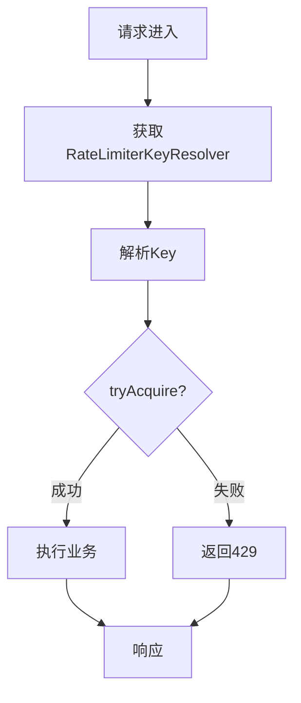

# 81-限流熔断

> 网关 - 限流熔断

---

## ① Why - 价值 (为什么)

**背景与痛点**

在分布式微服务架构中，每个服务都会接收大量请求。如果没有限流保护：
- 单个用户可能在一秒内发起上千次请求，直接打垮服务
- 恶意爬虫或攻击者可以低成本耗尽系统资源
- 突发流量（秒杀、促销）可能导致服务雪崩

**限流的价值**
- 保护后端服务不被突发流量击垮
- 保证服务质量，让正常用户有可用资源
- 在网关层限流，减少后端服务压力

**熔断的价值**
- 当下游服务故障时，快速失败，避免资源耗尽
- 防止故障级联传播，保护整体系统稳定性
- 故障恢复后自动尝试重启服务

**使用场景**
- API 接口防爬虫、防刷
- 秒杀活动流量控制
- 保护下游微服务不被过载
- 第三方 API 调用保护

---

## ② What - 定义 (是什么)

**限流 (Rate Limiting)**

限流是一种控制请求速率的机制，确保在给定时间窗口内的请求数量不超过预设阈值。

**核心概念**
- **时间窗口**：统计请求的时间范围（秒/分钟等）
- **限制阈值**：允许的最大请求数
- **Key 标识**：限流的粒度（IP、用户 ID、接口等）

**熔断 (Circuit Breaker)**

熔断是一种保护机制，当失败率达到阈值时快速失败，后续请求直接返回错误，不真正调用下游服务。

**核心状态**
- **CLOSED（关闭）**：正常状态，允许请求通过
- **OPEN（打开）**：故障状态，请求直接失败
- **HALF_OPEN（半开）**：尝试恢复，允许部分请求通过

**yudao-cloud 实现方案**
- 限流：基于 Redisson 分布式限流器实现
- 熔断：项目中暂未实现完整熔断器

---

## ③ How - 思维 (怎么做)

### 数据模型设计

**限流 Key 设计**

```
Redis Key: rate_limiter:{key}
- key 可以是：
  - default: 全局级别
  - user: 用户ID级别
  - clientIp: IP级别
  - serverNode: 服务器节点级别
  - 自定义表达式
```

### 限流算法

**固定窗口算法**
```
1. 将时间划分为固定窗口
2. 每个窗口独立计数
3. 超过阈值则拒绝

优点：实现简单
缺点：窗口临界点可能突增
```

**滑动窗口算法**
```
1. 维护一个滑动的时间窗口
2. 统计窗口内的请求数
3. 超过阈值则拒绝

优点：平滑限流
缺点：实现稍复杂
```

**令牌桶算法**
```
1. 以固定速率向桶添加令牌
2. 每个请求消耗一个令牌
3. 桶满时拒绝添加

优点：允许突发流量
缺点：实现需要额外存储
```

yudao-cloud 使用 Redisson 的 **RRateLimiter**，内部基于 **令牌桶算法** 实现。

### 关键流程设计

**限流执行流程**

```
请求进来 → 解析限流 Key → 获取限流器 → 尝试获取令牌 → 
|→ 成功 → 执行业务逻辑
|→ 失败 → 返回 429 Too Many Requests
```



### 关键代码设计

**1. 限流注解**

```java
@Target({ElementType.METHOD})
@Retention(RetentionPolicy.RUNTIME)
public @interface RateLimiter {
    // 限流时间，默认1秒
    int time() default 1;
    // 时间单位
    TimeUnit timeUnit() default TimeUnit.SECONDS;
    // 限流次数
    int count() default 100;
    // 错误提示信息
    String message() default "";
    // Key解析器
    Class<? extends RateLimiterKeyResolver> keyResolver() 
        default DefaultRateLimiterKeyResolver.class;
    // Key参数（表达式用）
    String keyArg() default "";
}
```

**2. AOP 拦截处理**

```java
@Aspect
public class RateLimiterAspect {

    @Before("@annotation(rateLimiter)")
    public void beforePointCut(JoinPoint joinPoint, RateLimiter rateLimiter) {
        // 1. 获取 Key 解析器
        RateLimiterKeyResolver keyResolver = keyResolvers.get(rateLimiter.keyResolver());
        
        // 2. 解析限流 Key
        String key = keyResolver.resolver(joinPoint, rateLimiter);
        
        // 3. 尝试获取限流令牌
        boolean success = rateLimiterRedisDAO.tryAcquire(key,
            rateLimiter.count(), rateLimiter.time(), rateLimiter.timeUnit());
        
        // 4. 失败则抛异常
        if (!success) {
            throw new ServiceException(GlobalErrorCodeConstants.TOO_MANY_REQUESTS);
        }
    }
}
```

**3. Redis 限流实现**

```java
public class RateLimiterRedisDAO {

    private final RedissonClient redissonClient;

    public Boolean tryAcquire(String key, int count, int time, TimeUnit timeUnit) {
        // 1. 获取 Redisson 分布式限流器
        RRateLimiter rateLimiter = getRRateLimiter(key, count, time, timeUnit);
        // 2. 尝试获取 1 个令牌
        return rateLimiter.tryAcquire();
    }

    private RRateLimiter getRRateLimiter(String key, long count, int time, TimeUnit timeUnit) {
        String redisKey = "rate_limiter:" + key;
        RRateLimiter rateLimiter = redissonClient.getRateLimiter(redisKey);
        Duration duration = Duration.ofSeconds(timeUnit.toSeconds(time));
        
        // 3. 首次设置限流规则
        if (rateLimiter.getConfig() == null) {
            rateLimiter.trySetRate(RateType.OVERALL, count, duration);
            rateLimiter.expire(duration);
        }
        return rateLimiter;
    }
}
```

**4. Key 解析器接口**

```java
public interface RateLimiterKeyResolver {
    /**
     * 解析限流 Key
     */
    String resolver(JoinPoint joinPoint, RateLimiter rateLimiter);
}
```

**5. 内置 Key 解析器**

| 解析器 | 说明 | 示例 Key |
|--------|------|---------|
| DefaultRateLimiterKeyResolver | 全局级别 | rate_limiter:default |
| UserRateLimiterKeyResolver | 用户ID级别 | rate_limiter:user:123 |
| ClientIpRateLimiterKeyResolver | IP级别 | rate_limiter:ip:192.168.1.100 |
| ServerNodeRateLimiterKeyResolver | 服务器节点 | rate_limiter:node:server-01 |
| ExpressionRateLimiterKeyResolver | 自定义表达式 | rate_limiter:mobile:138****1234 |

### 目录结构

```
yudao-framework/
└── yudao-spring-boot-starter-protection/
    └── src/main/java/cn/iocoder/yudao/framework/
        ├── ratelimiter/
        │   ├── config/
        │   │   └── YudaoRateLimiterConfiguration.java    # 自动配置
        │   └── core/
        │       ├── annotation/
        │       │   └── RateLimiter.java                  # 限流注解
        │       ├── aop/
        │       │   └── RateLimiterAspect.java            # AOP拦截
        │       ├── keyresolver/
        │       │   ├── RateLimiterKeyResolver.java       # 解析器接口
        │       │   └── impl/
        │       │       ├── DefaultRateLimiterKeyResolver.java
        │       │       ├── UserRateLimiterKeyResolver.java
        │       │       ├── ClientIpRateLimiterKeyResolver.java
        │       │       ├── ServerNodeRateLimiterKeyResolver.java
        │       │       └── ExpressionRateLimiterKeyResolver.java
        │       └── redis/
        │           └── RateLimiterRedisDAO.java              # Redis实现
        ├── idempotent/                                  # 幂等性
        ├── lock4j/                                     # 分布式锁
        └── signature/                                   # 签名验证
```

---

## ④ Hard - 难点 (挑战)

### 难点1：限流粒度选择

**问题**：限流粒度太粗会导致误杀，粒度太细管理复杂

**解决方案**：多种 Key 解析器适配不同场景

```java
// 全局限流 - 所有请求共享
@RateLimiter(count = 100, keyResolver = DefaultRateLimiterKeyResolver.class)

// 用户级限流 - 每个用户独立计数
@RateLimiter(count = 10, keyResolver = UserRateLimiterKeyResolver.class)

// IP级限流 - 每个IP独立计数  
@RateLimiter(count = 50, keyResolver = ClientIpRateLimiterKeyResolver.class)

// 自定义限流 - 基于请求参数
@RateLimiter(count = 5, keyResolver = ExpressionRateLimiterKeyResolver.class, 
           keyArg = "#reqVO.mobile")
```

### 难点2：分布式限流一致性

**问题**：多台服务实例如何保证限流一致性

**解决方案**：使用 Redis 分布式限流器，所有实例共享同一个计数器

```
                    ┌─────────────┐
        请求 ───────→│  Gateway   │
                    │  Server A  │──→ Redis ──→ rate_limiter:key
                    └─────────────┘
                    ┌─────────────┐
                    │  Gateway   │
                    │  Server B  │──→ Redis ──→ rate_limiter:key
                    └─────────────┘
```

### 难点3：限流阈值配置

**问题**：如何设置合理的限流阈值

**解决方案**：基于实际流量进行动态调整

```
1. 初始设置：根据经验值或压测结果
2. 监控调整：根据实际请求成功率优化
3. 动态配置：支持通过配置中心调整
```

### 难点4：熔断器缺失

**问题**：yudao-cloud 暂未实现完整的熔断器

**影响**：
- 下游服务故障时无法快速失败
- 可能导致请求堆积和资源耗尽
- 故障可能级联传播

**解决方案**：可以使用 Sentinel 或 Resilience4j 实现

---

## ⑤ Metric - 衡量 (指标)

| 指标 | 权重 | 说明 | 验证方法 |
|------|------|------|----------|
| 限流拦截率 | 25% | 正确拦截超过阈值的请求 | 模拟高并发测试 |
| 限流通过率 | 25% | 正常请求不被误杀 | 模拟正常请求测试 |
| 限流精度 | 20% | 实际请求数与阈值偏差 | 压测统计 |
| 性能影响 | 15% | 限流对响应时间的影响 | 性能压测 |
| 可配置性 | 15% | 支持动态调整阈值 | 配置中心修改 |

**限流效果验证**

```bash
# 压测命令
ab -n 200 -c 20 http://localhost:8080/api/test

# 预期结果：
# - 前100个请求成功
# - 101-200个请求返回429
```

---

## ⑥ Select - 选型 (选哪个)

### 方案对比

| 方案 | 优点 | 缺点 | 适用场景 |
|------|------|------|----------|
| **Redisson RRateLimiter** | 支持分布式、基于Redis、无需额外部署 | 依赖Redis | yudao-cloud 当前方案 |
| Bucket4j + Hazelcast | 性能高 | 需额外组件 | 单机或 Hazelcast 集群 |
| Sentinel | 完整限流+熔断+降级 | 学习成本高 | 需要熔断的场景 |
| Resilience4j | 轻量、Java原生 | 无可视化 | Spring Boot 项目 |
| Nginx limit_req | 网关层限流 | 粒度粗 | 基础限流需求 |

### 选型理由

**yudao-cloud 选择 Redisson RRateLimiter**：

```
1. 已有 Redisson 依赖（分布式锁也在用）
2. 支持分布式限流，多实例共享计数
3. 实现简单，注解驱动
4. 与项目技术栈一致
```

### 工具集

- 压测工具：Apache Bench (ab)、wrk、JMeter
- Redis 客户端：redis-cli、Redis Desktop Manager
- 监控：Grafana + Redis Exporter

---

## ⑦ Impl - 实现 (细节)

### 使用方式

**1. 引入依赖**

```xml
<!-- yudao-framework 已包含，无需额外引入 -->
<dependency>
    <groupId>cn.iocoder.yudao</groupId>
    <artifactId>yudao-spring-boot-starter-protection</artifactId>
</dependency>
```

**2. 使用注解**

```java
@RestController
public class TestController {

    // 全局限流：每秒100次
    @GetMapping("/test1")
    @RateLimiter(time = 1, count = 100)
    public String test1() {
        return "success";
    }

    // 用户限流：每分钟10次
    @GetMapping("/test2")
    @RateLimiter(time = 1, count = 10, timeUnit = TimeUnit.MINUTES,
                keyResolver = UserRateLimiterKeyResolver.class)
    public String test2() {
        return "success";
    }

    // IP限流：每秒50次
    @GetMapping("/test3")
    @RateLimiter(time = 1, count = 50,
                keyResolver = ClientIpRateLimiterKeyResolver.class)
    public String test3() {
        return "success";
    }

    // 自定义限流：基于手机号，每分钟5次（防刷验证码）
    @PostMapping("/sendSms")
    @RateLimiter(time = 1, count = 5, timeUnit = TimeUnit.MINUTES,
                 keyResolver = ExpressionRateLimiterKeyResolver.class,
                 keyArg = "#reqVO.mobile")
    public String sendSms(@RequestBody SendSmsReqVO reqVO) {
        return "success";
    }
}
```

**3. 抛出异常**

```java
// 当限流触发时，抛出 ServiceException
// errorCode = 429
// errorMsg = "请求过于频繁，请稍后重试"
```

### 配置详解

**Key 解析器选择**

| 场景 | 推荐解析器 | 示例 |
|------|----------|------|
| 公开接口防爬 | ClientIpRateLimiterKeyResolver | 按IP限流 |
| 用户功能保护 | UserRateLimiterKeyResolver | 按用户ID限流 |
| 敏感操作保护 | ExpressionRateLimiterKeyResolver | 按手机号/邮箱限流 |
| 内部服务调用 | ServerNodeRateLimiterKeyResolver | 按服务节点限流 |

**参数建议**

| 场景 | 建议阈值 |
|------|----------|
| 公开查询接口 | 100次/秒 |
| 用户操作接口 | 30次/分钟 |
| 验证码发送 | 5次/分钟 |
| 登录接口 | 10次/分钟 |

### 核心 Bean

```java
@Configuration
public class YudaoRateLimiterConfiguration {

    @Bean
    public RateLimiterAspect rateLimiterAspect(
            List<RateLimiterKeyResolver> keyResolvers,
            RateLimiterRedisDAO rateLimiterRedisDAO) {
        return new RateLimiterAspect(keyResolvers, rateLimiterRedisDAO);
    }

    @Bean
    public RateLimiterRedisDAO rateLimiterRedisDAO(RedissonClient redissonClient) {
        return new RateLimiterRedisDAO(redissonClient);
    }
}
```

### 失败恢复机制

**限流触发后的处理**

```
1. 前端收到 429 响应
2. 显示友好提示："请求过于频繁，请稍后重试"
3. 延迟重试（指数退避）
4. 用户感知：需要等待一个时间窗口
```

---

## ⑧ SKILL - 提炼 (复用)

### 触发条件

```
场景1：需要保护 API 接口不被刷量
场景2：需要控制用户请求频率
场景3：需要防止恶意爬虫
场景4：需要保护下游服务
```

### 执行流程

```
Step 1: 引入依赖
  → yudao-spring-boot-starter-protection 已包含

Step 2: 使用注解
  → 在需要限流的方法上添加 @RateLimiter

Step 3: 配置参数
  → time: 时间长度
  → count: 允许次数
  → keyResolver: Key解析器

Step 4: 测试验证
  → 压测验证限流效果
```

### 配方/素材

**技术栈**：Java 8+, Spring Boot, Redisson
**依赖包**：Redisson（已有）
**配置**：无额外配置，注解驱动

### 使用示例

```java
// 验证码发送限流
@RateLimiter(time = 1, count = 5, timeUnit = TimeUnit.MINUTES,
            keyResolver = ExpressionRateLimiterKeyResolver.class,
            keyArg = "#reqVO.mobile",
            message = "发送太频繁，请1分钟后再试")
public AjaxResult sendCode(SendCodeReqVO reqVO) {
    // 发送验证码逻辑
}
```

### 扩展建议

**熔断器扩展（待实现）**

```java
// 使用 Sentinel 实现熔断
@SentinelResource(value = "test", fallback = "fallback")
public String test() {
    return remoteService.call();
}

public String fallback() {
    return "服务降级，返回默认响应";
}
```

### 验收标准

```
- [x] 限流注解可以正常使用
- [x] 支持多种 Key 解析器
- [x] 限流触发返回 429 错误
- [x] Redis 分布式限流工作正常
- [ ] 网关层限流（待实现）
- [ ] 熔断器（待实现）
```

---

## 附录：相关资料

### Redis RateLimiter 文档

- Redisson 官方：https://redisson.org
- RRateLimiter API：https://www.javadoc.io/doc/org.redisson/redisson/latest/org/redisson/api/RRateLimiter.html

### 推荐阅读

- 限流算法：https://en.wikipedia.org/wiki/Rate_limiting
- 熔断器模式：https://martinfowler.com/bliki/CircuitBreaker.html

### 相关任务

- 82-流控规则
- 83-降级策略
- 84-热点参数