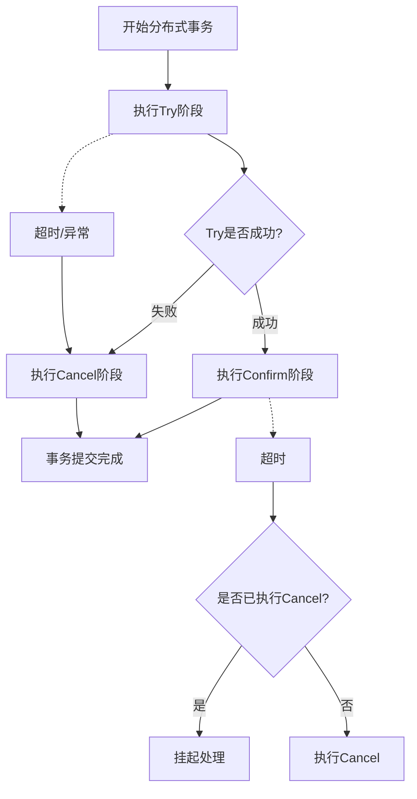
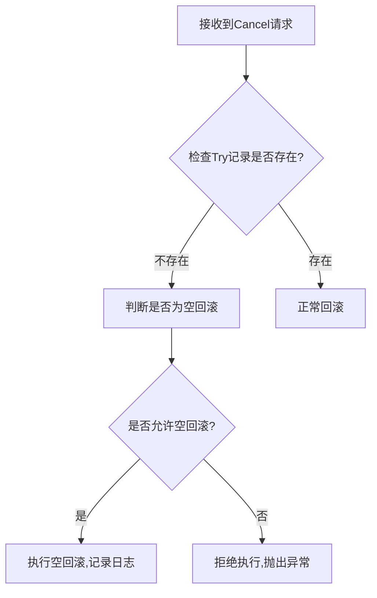
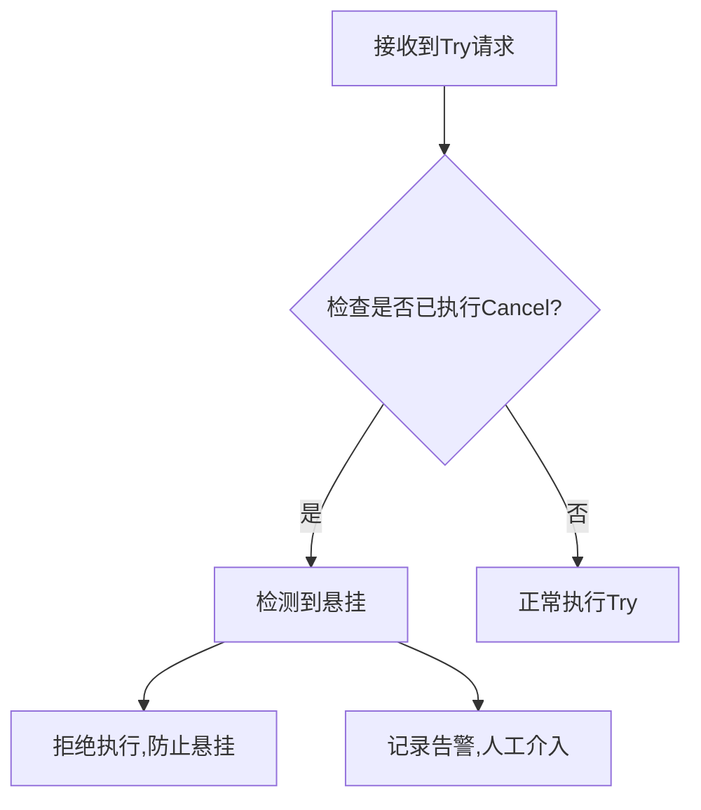
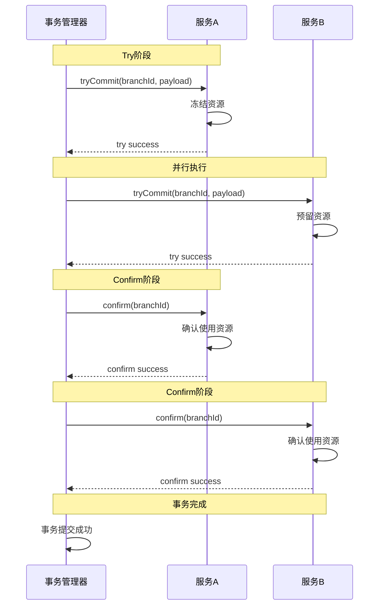
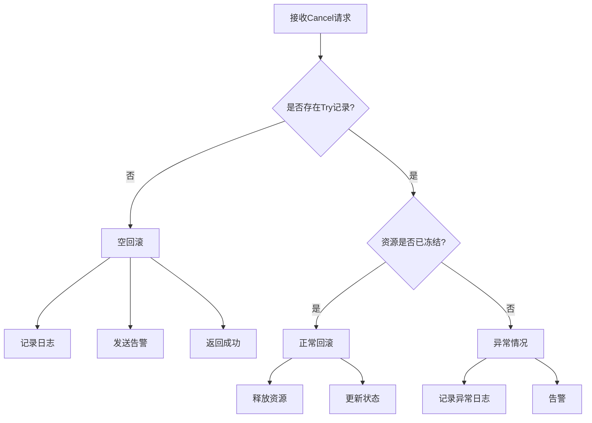

# 87-空回滚与悬挂

> 分布式事务 - 空回滚与悬挂

---

## ① Why - 价值 (为什么)

### 背景与痛点

在分布式系统架构中，多个服务之间的数据一致性是一个核心难题。传统的单机事务无法跨服务、跨数据库保证一致性，因此需要引入分布式事务方案。TCC（Try-Confirm-Cancel）是一种常见的分布式事务实现模式，但实现不当会出现**空回滚**和**悬挂**问题。

### 业务场景

```
举例：用户下单业务流程
- 库存服务：冻结库存（Try）→ 扣减库存（Confirm）→ 解冻库存（Cancel）
- 订单服务：创建订单（Try）→ 确认订单（Confirm）→ 取消订单（Cancel）
- 支付服务：预支付（Try）→ 确认支付（Confirm）→ 取消支付（Cancel）
```

如果这些步骤中出现任何一个环节失败，需要回滚整个分布式事务。但TCC实现不完善时，就会出现空回滚或悬挂问题。

---

## ② What - 定义 (是什么)

### 核心概念

| 概念 | 定义 | 示例 |
|------|------|------|
| **空回滚** | 在分布式事务中，Try阶段未执行或未成功，但Cancel阶段被执行并回滚 | Try阶段网络超时未执行，但Confirm阶段被调用执行了空回滚 |
| **悬挂** | 指的是在TCC事务中，Confirm或Cancel操作比Try操作先执行，导致事务状态不一致 | Try阶段超时，Cancel先执行，后续Try才执行，导致资源被永久锁定 |

### 空回滚与悬挂的关系

```
正常流程：
Try → Confirm → 完成

空回滚场景：
Try未执行 → Cancel执行 → 回滚（这是正确的）

悬挂场景：
Try超时 → Cancel执行 → Try恢复执行 → Confirm → 资源被永久占用
```

---

## ③ How - 思维 (怎么做)

### 数据模型设计

#### TCC事务记录表

```sql
-- TCC事务控制表
CREATE TABLE tcc_transaction (
    id BIGINT PRIMARY KEY AUTO_INCREMENT,
    global_id VARCHAR(64) NOT NULL COMMENT '全局事务ID',
    branch_id VARCHAR(64) NOT NULL COMMENT '分支事务ID',
    status INT NOT NULL DEFAULT 0 COMMENT '状态: 0-初始 1-Try 2-Confirm 3-Cancel',
    resource_id VARCHAR(64) COMMENT '资源ID',
    payload TEXT COMMENT '业务数据',
    gmt_create DATETIME DEFAULT CURRENT_TIMESTAMP,
    gmt_modified DATETIME DEFAULT CURRENT_TIMESTAMP ON UPDATE CURRENT_TIMESTAMP,
    UNIQUE KEY uk_global_branch (global_id, branch_id)
);
```

#### 分支事务执行记录

```sql
-- 分支事务执行记录
CREATE TABLE tcc_branch_record (
    id BIGINT PRIMARY KEY AUTO_INCREMENT,
    global_id VARCHAR(64) NOT NULL COMMENT '全局事务ID',
    branch_id VARCHAR(64) NOT NULL COMMENT '分支事务ID',
    service_name VARCHAR(64) NOT NULL COMMENT '服务名称',
    status INT NOT NULL DEFAULT 0 COMMENT '状态: 0-初始 1-Try成功 2-Confirm成功 3-Cancel成功',
    gmt_create DATETIME DEFAULT CURRENT_TIMESTAMP,
    UNIQUE KEY uk_branch (branch_id)
);
```

### 关键流程设计

#### TCC事务流程图



#### 空回滚处理流程



#### 悬挂处理流程



### 关键代码设计

#### TCC接口定义

```java
/**
 * TCC资源接口
 */
public interface TccResource {
    
    /**
     * Try阶段 - 预留资源
     */
    void tryCommit(String branchId, String payload);
    
    /**
     * Confirm阶段 - 确认使用资源
     */
    void confirm(String branchId);
    
    /**
     * Cancel阶段 - 取消预留
     */
    void cancel(String branchId, String payload);
}

/**
 * 账户服务TCC实现
 */
@TccService(name = "accountService")
public class AccountTccServiceImpl implements TccResource {
    
    @Override
    public void tryCommit(String branchId, String payload) {
        // 1. 解析请求参数
        AccountBalanceRequest request = JSON.parseObject(payload, AccountBalanceRequest.class);
        
        // 2. 记录分支事务
        tccBranchRecordService.saveBranch(branchId, request);
        
        // 3. 冻结余额（预留资源）
        accountDao.freezeBalance(request.getUserId(), request.getAmount());
    }
    
    @Override
    public void confirm(String branchId) {
        // 1. 查询分支事务记录
        TccBranchRecord record = tccBranchRecordService.getByBranchId(branchId);
        if (record == null) {
            // 可能是空Confirm，检查是否有Try记录
            // 如果没有Try记录，可能需要忽略或记录告警
            return;
        }
        
        // 2. 确认扣款（从冻结转为实际扣减）
        accountDao.confirmDeduct(record.getUserId(), record.getAmount());
    }
    
    @Override
    public void cancel(String branchId, String payload) {
        // 1. 查询是否有Try记录（用于检测空回滚）
        TccBranchRecord tryRecord = tccBranchRecordService.getByBranchId(branchId);
        
        if (tryRecord == null) {
            // 2. 没有Try记录，判定为【空回滚】
            // 检查payload是否有预留数据，如果有则说明是空回滚
            AccountBalanceRequest request = JSON.parseObject(payload, AccountBalanceRequest.class);
            
            // 空回滚处理：记录日志，但不真正执行回滚
            log.warn("检测到空回滚，branchId={}, payload={}", branchId, payload);
            
            // 可选：记录告警
            alertService.send("检测到空回滚", branchId, payload);
            return;
        }
        
        // 3. 有Try记录，正常回滚
        accountDao.unfreezeBalance(tryRecord.getUserId(), tryRecord.getAmount());
    }
}
```

#### 空回滚检测与处理

```java
@Component
public class TccTransactionManager {
    
    /**
     * 检测并处理空回滚
     */
    public boolean detectAndHandleEmptyRollback(String branchId, String payload) {
        // 1. 检查是否有Try阶段记录
        TccBranchRecord tryRecord = branchRecordDao.findByBranchId(branchId);
        
        if (tryRecord == null) {
            // 2. 无Try记录，判定为空回滚
            log.warn("空回滚检测到，branchId={}", branchId);
            
            // 3. 检查payload是否有预留数据
            if (StringUtils.isNotBlank(payload)) {
                // 4. 有payload数据，说明可能Try阶段超时未记录
                // 这种情况需要特殊处理
                handleTryTimeoutWithCancel(branchId, payload);
            }
            
            // 5. 记录空回滚日志
            recordEmptyRollback(branchId, payload);
            
            // 6. 返回true表示已处理，不执行实际回滚
            return true;
        }
        
        return false;
    }
    
    /**
     * 处理Try超时但Cancel已执行的情况（悬挂）
     */
    public boolean detectAndHandle悬挂(String branchId, String payload) {
        // 1. 检查是否已执行Cancel
        TccBranchRecord cancelRecord = branchRecordDao.findByBranchIdAndStatus(
            branchId, BranchStatus.CANCEL);
        
        if (cancelRecord != null) {
            // 2. 检测到悬挂
            log.error("检测到悬挂，branchId={}, tryPayload={}", branchId, payload);
            
            // 3. 记录告警
            alertService.send("TCC悬挂告警", branchId, payload);
            
            // 4. 拒绝执行Try，防止资源泄漏
            throw new BusinessException("检测到事务悬挂，拒绝执行Try");
        }
        
        return false;
    }
}
```

---

## ④ Hard - 难点 (挑战)

### 问题1：空回滚的识别与处理

**场景**：Try阶段由于网络问题未能正常执行，但Cancel阶段被调用

```
时间线：
T1: Try执行，冻结库存
T2: 事务管理器发送Confirm请求
T3: Confirm响应超时，事务管理器决定回滚
T4: Cancel执行
```

**难点**：
- 如何判断是空回滚还是正常回滚？
- 空回滚是否需要记录？
- 如何防止空回滚导致的业务数据不一致？

**解决方案**：
```java
// 使用Try阶段记录来判断
public void cancel(String branchId, String payload) {
    TccBranchRecord tryRecord = branchRecordDao.findByBranchId(branchId);
    
    if (tryRecord == null) {
        // 无Try记录，判定为空回滚
        // 处理方式：记录日志，发送告警，但不执行实际回滚
        log.warn("空回滚，branchId={}", branchId);
        alertService.send("空回滚告警", branchId);
        return;
    }
    
    // 有Try记录，正常回滚
    doRollback(tryRecord);
}
```

### 问题2：悬挂的识别与预防

**场景**：Cancel比Try先执行，导致资源被永久占用

```
时间线：
T1: Try开始执行
T2: Try执行超时
T3: 事务管理器发送Cancel
T4: Cancel执行完成，资源已释放
T5: Try恢复执行，返回成功
T6: Confirm执行，但资源已被释放 → 出现问题
```

**解决方案**：
```java
@TccResource
public void tryCommit(String branchId, String payload) {
    // 1. 检测是否已执行Cancel（检测悬挂）
    TccBranchRecord cancelRecord = branchRecordDao.findByBranchIdAndStatus(
        branchId, BranchStatus.CANCEL);
    
    if (cancelRecord != null) {
        // 2. 检测到悬挂，拒绝执行
        throw new BusinessException("检测到事务悬挂，Try拒绝执行");
    }
    
    // 3. 正常执行业务逻辑
    doTry(branchId, payload);
}
```

### 问题3：幂等性保证

**场景**：Confirm/Cancel可能被重复调用

**难点**：
- 网络抖动导致重试
- 事务管理器超时重新发送

**解决方案**：
```java
@Override
public void confirm(String branchId) {
    // 1. 检查是否已执行过
    TccBranchRecord record = branchRecordDao.findByBranchId(branchId);
    if (record != null && record.getStatus() == BranchStatus.CONFIRM) {
        log.info("Confirm已执行，branchId={}", branchId);
        return;
    }
    
    // 2. 执行确认操作
    doConfirm(branchId);
    
    // 3. 更新状态
    branchRecordDao.updateStatus(branchId, BranchStatus.CONFIRM);
}
```

### 问题4：防悬挂的超时控制

**场景**：Try执行时间过长，Cancel已经执行

**解决方案**：
```yaml
# TCC配置
tcc:
  transaction:
    timeout: 30000  # 全局事务超时时间
    max retry: 3   # 最大重试次数
    confirm-timeout: 10000  # Confirm阶段超时
    cancel-timeout: 10000   # Cancel阶段超时
```

---

## ⑤ Metric - 衡量 (指标)

### 指标设计

| 指标 | 权重 | 说明 | 验证方法 |
|------|------|------|----------|
| 空回滚检测准确率 | 25% | 能准确识别空回滚场景 | 模拟测试 |
| 悬挂检测准确率 | 25% | 能准确识别并阻止悬挂 | 模拟测试 |
| 幂等性保证 | 20% | 重复调用不产生副作用 | 压力测试 |
| 超时控制有效性 | 15% | 能在超时前检测异常 | 超时测试 |
| 告警及时性 | 15% | 异常能及时告警 | 监控验证 |

### 验证方法

```bash
# 1. 空回滚测试
# 场景：Try未执行，直接执行Cancel
# 预期：记录空回滚日志，不抛出异常

# 2. 悬挂测试
# 场景：Cancel先于Try执行
# 预期：Try执行时抛出异常，拒绝执行

# 3. 幂等性测试
# 场景：Confirm重复调用
# 预期：只执行一次，不重复扣款

# 4. 超时测试
# 场景：Try执行超过超时时间
# 预期：触发Cancel，检测悬挂
```

---

## ⑥ Select - 选型 (选哪个)

### 候选方案对比

| 方案 | 优点 | 缺点 | 适用场景 |
|------|------|------|----------|
| **Seata AT模式** | 自动生成回滚SQL，对业务无侵入 | 需要undo_log表，性能开销 | 简单业务，对性能要求不高 |
| **Seata TCC模式** | 性能高，可自定义资源控制 | 业务需要改造成TCC接口 | 高性能要求的业务 |
| **Saga模式** | 长流程友好，适合编排 | 无隔离性，需要业务补偿 | 流程长、补偿简单的场景 |
| **本地事务表** | 实现简单，不依赖外部 | 单点风险，扩展性差 | 小规模系统 |

### 选型理由

本项目选择 **TCC模式**，原因：

1. **高性能**：相较于AT模式，TCC直接操作数据库，无undo_log解析开销
2. **可控性强**：业务可以完全控制资源预留和释放
3. **社区成熟**：Seata TCC模式有完善的空回滚/悬挂处理机制
4. **与业务匹配**：订单、库存、支付等场景天然适合TCC

### 参考资料

- Seata官方文档：https://seata.io/zh-cn/docs/overview/what-is-seata.html
- TCC开源实现：https://github.com/seata/seata/tree/master/tcc

---

## ⑦ Impl - 实现 (细节)

### yudao-cloud中的事务处理

#### 本地事务使用

```java
// yudao-module-pay 服务中的事务使用
// 文件：PayWalletRechargeServiceImpl.java
@Service
public class PayWalletRechargeServiceImpl implements PayWalletRechargeService {
    
    @Override
    @Transactional(rollbackFor = Exception.class)  // 本地事务
    public void recharge(Long userId, BigDecimal amount) {
        // 1. 校验余额
        PayWallet wallet = walletDao.selectByUserId(userId);
        
        // 2. 增加余额
        walletDao.incrementBalance(userId, amount);
        
        // 3. 记录流水
        transactionDao.insert(buildTransaction(userId, amount));
    }
}
```

#### 分布式事务现状

当前 yudao-cloud 项目**未引入 Seata**，主要使用：
1. `@Transactional` 本地事务
2. 消息队列最终一致性
3. 补偿机制处理跨服务数据一致性

#### 未来扩展建议

如需引入分布式事务，可考虑：

```xml
<!-- 添加Seata依赖 -->
<dependency>
    <groupId>io.seata</groupId>
    <artifactId>seata-spring-boot-starter</artifactId>
    <version>1.7.1</version>
</dependency>
```

```yaml
# Seata配置
seata:
  enabled: true
  application-id: yudao-trade
  tx-service-group: my_test_tx_group
```

### 关键步骤校验

#### Step 1: 检测空回滚

| 校验点 | 验证方法 |
|--------|----------|
| Try记录是否存在 | 查询tcc_branch_record表 |
| payload是否有数据 | 解析JSON判断 |

#### Step 2: 检测悬挂

| 校验点 | 验证方法 |
|--------|----------|
| Cancel是否已执行 | 查询status=3的记录 |
| Try是否超时 | 检查gmt_create与当前时间差 |

#### Step 3: 幂等性保证

| 校验点 | 验证方法 |
|--------|----------|
| 状态是否已变更 | 查询当前状态 |
| 返回值是否幂等 | 重复调用测试 |

### 约束条件

- 使用Seata 1.7.1及以上版本
- TCC接口需标注@TccResource注解
- Try/Confirm/Cancel需要保证幂等性
- 超时时间配置不超过30秒

---

## ⑧ SKILL - 提炼 (复用)

### 触发条件

```
场景1：引入分布式事务框架（Seata）
场景2：实现TCC模式的业务服务
场景3：需要处理跨服务的数据一致性
```

### 执行流程

```
Step 1: 添加依赖
  - seata-spring-boot-starter

Step 2: 配置Seata
  - 配置registry.conf
  - 配置file.conf

Step 3: 改造业务接口
  - 添加@TccResource注解
  - 实现tryCommit/confirm/cancel方法

Step 4: 处理空回滚和悬挂
  - 在tryCommit中检测Cancel状态
  - 在cancel中检测Try记录

Step 5: 验证
  - 模拟异常场景测试
  - 检查告警是否正常
```

### 配方/素材

**技术栈**：Java 8+, Spring Boot 2.7+, Seata 1.7.1
**依赖包**：
```xml
<dependency>
    <groupId>io.seata</groupId>
    <artifactId>seata-spring-boot-starter</artifactId>
    <version>1.7.1</version>
</dependency>
```

**配置示例**：
```yaml
seata:
  tx-service-group: yudao_tx_group
  service:
    vgroup-mapping:
      yudao_tx_group: default
  registry:
    type: nacos
    nacos:
      server-addr: 127.0.0.1:8848
```

### 验收标准

```
- [ ] 功能正常：TCC接口能正常调用
- [ ] 空回滚检测：能准确识别空回滚并处理
- [ ] 悬挂检测：能检测并阻止悬挂
- [ ] 幂等性保证：重复调用不产生副作用
- [ ] 超时控制：能在超时前检测异常
- [ ] 告警功能：异常能及时发送告警
```

---

## 附录：流程图

### 完整TCC事务流程



### 空回滚处理流程



---

## 参考资料

1. Seata官方文档：https://seata.io/zh-cn/
2. TCC模式实战：https://github.com/seata/seata/tree/master/tcc
3. 分布式事务设计模式：https://microservices.io/patterns/data/saga.html